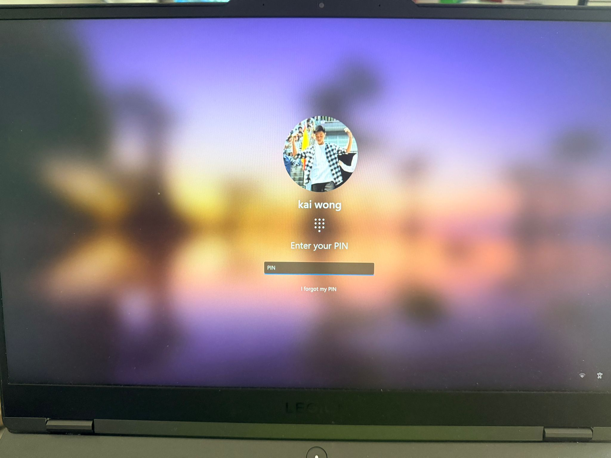
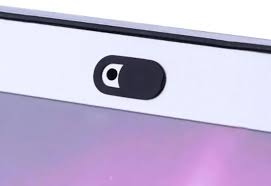

## A10 – Privacy Offline

## Description
I explored how privacy is protected in offline environments by securing access to devices and preventing unauthorised access or recording.

## Findings
- Device encryption protects stored data
- Login authentication (PIN/password) restricts access
- Microphone and camera blockers prevent unauthorised recording
- Limiting physical access to devices improves privacy

## Evidence
Figure 1: Login authentication using a PIN to restrict access.

Figure 2: Camera cover used to block webcam and prevent unauthorised recording.

## Analysis
Offline privacy focuses on protecting data stored on devices from unauthorised access and surveillance. Authentication methods such as PINs ensure that only authorised users can access the system. Physical tools like camera covers and microphone blockers prevent unauthorised recording, protecting users from potential privacy breaches. These measures are especially important in shared environments where devices may be exposed to others. Together, they provide both digital and physical layers of privacy protection.

## Reflection
This activity showed that privacy protection involves both system security and physical measures to prevent unauthorised access and recording.

