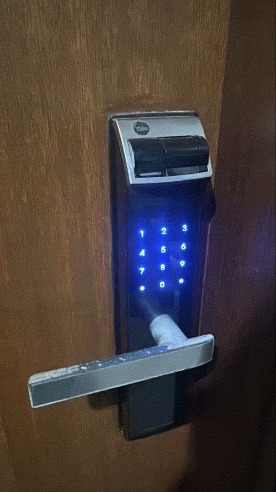
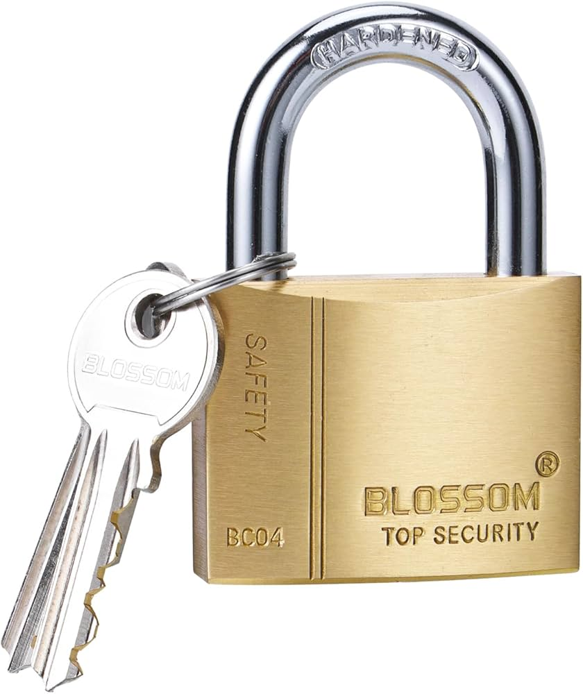
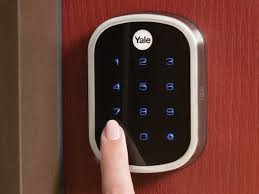

## A11_5_access_control_devices

## Description
I explored different types of access control devices used to restrict entry and ensure that only authorised individuals can access specific areas.

## Findings
- Key-based locks used for basic physical security
- RFID card access systems commonly used in buildings
- Biometric systems such as fingerprint scanners
- Keypad entry systems requiring a password or PIN
- Automatic access systems such as garage doors

## Evidence
Figure 1: RFID card access system used to restrict entry to authorised individuals.

Figure 2: Biometric fingerprint lock allowing access only to registered users.

Figure 3: Garage door acting as a controlled access system to secure property.

Figure 4: Key-based lock used for basic physical security.

Figure 5: Keypad entry system requiring a PIN for access.

## Analysis
Access control devices are essential for preventing unauthorised access to restricted areas. Traditional key-based locks provide basic security but can be vulnerable to key duplication or loss. RFID systems offer greater convenience and allow access to be easily managed and revoked. Biometric systems such as fingerprint scanners provide a higher level of security by relying on unique physical characteristics that are difficult to replicate. Keypad systems require a PIN, adding another authentication factor. Automatic systems like garage doors enhance convenience while maintaining controlled access. Combining multiple access control methods, such as card access with biometric verification, significantly improves overall security.

## Reflection
This activity helped me understand how different access control technologies are used in everyday environments. It highlighted the importance of selecting appropriate security measures based on the level of protection required.