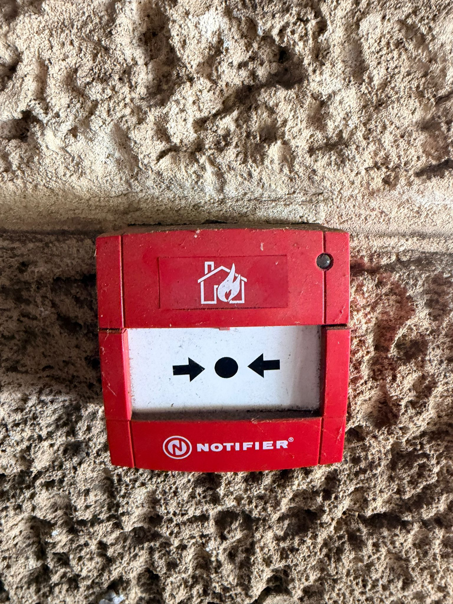
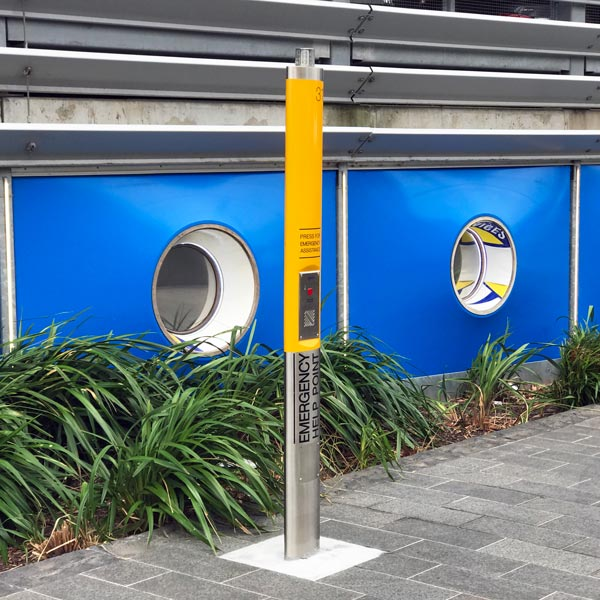
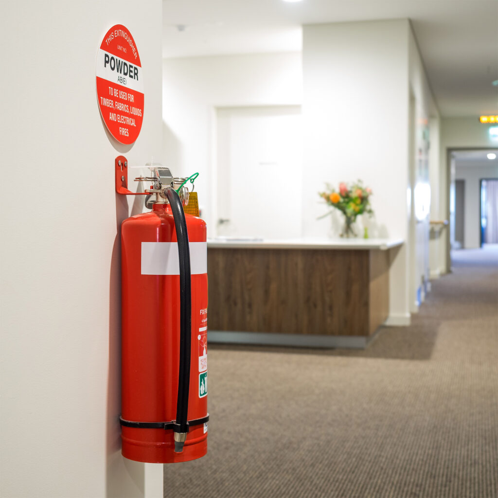
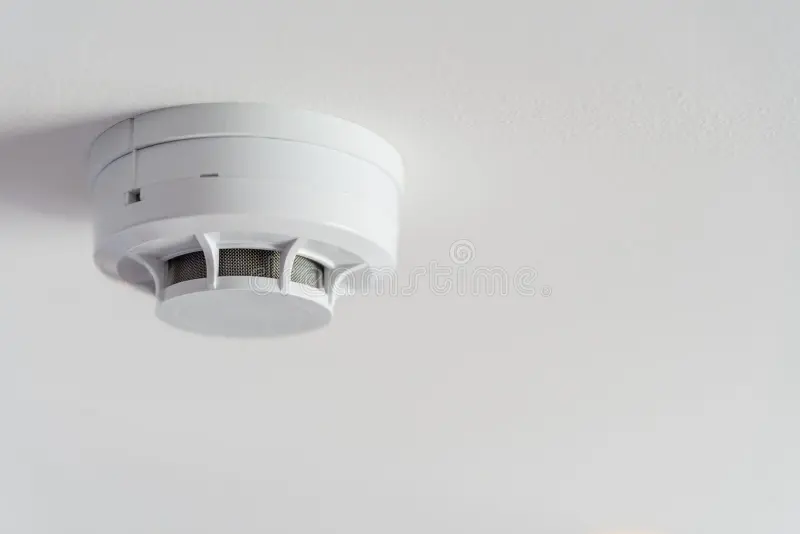

## A12_5_offline_security_tools

## Description
I explored different offline security tools used in real-world environments to enhance safety and provide protection without relying on internet connectivity.

## Findings
- Fire alarm systems used to alert occupants during emergencies
- Smoke alarms used to detect smoke and provide early warning of fire
- Emergency exit signs guiding people to safe evacuation routes
- Emergency help points allowing individuals to request immediate assistance
- Fire extinguishers used to control small fires and prevent escalation

## Evidence
Figure 1: Fire alarm activation system used to alert occupants during emergencies.

Figure 2: Emergency exit sign guiding individuals to safe evacuation routes.

Figure 3: Emergency help point allowing individuals to request immediate assistance.

Figure 4: Fire extinguishers used to control small fires and prevent escalation

Figure 5: Smoke alarm installed to detect smoke and provide early warning of fire.

## Analysis
Offline security tools play a critical role in ensuring safety, especially during emergencies when internet connectivity may not be available. Fire alarms and smoke detectors provide early warnings that allow occupants to respond quickly and evacuate safely. Emergency exit signs help guide individuals out of buildings efficiently, reducing panic and confusion. Emergency help points enable users to contact authorities directly, improving response time during incidents. Fire extinguishers provide immediate response capability to control small fires before they escalate. These tools are highly reliable as they operate independently of digital networks, but their effectiveness depends on regular maintenance and user awareness.

## Reflection
This activity helped me understand the importance of offline security tools in maintaining safety in everyday environments. It showed that even without advanced digital systems, essential safety mechanisms play a vital role in protecting people and property.