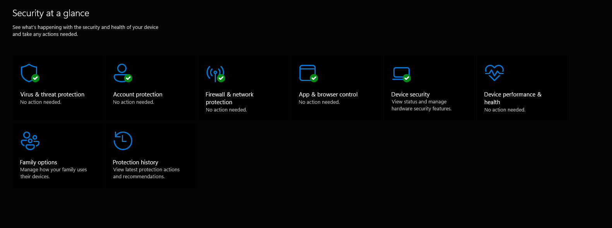

## A13_5_Online_Security_Tools

## Description
I explored various online security tools that are used to protect devices, data, and users from cyber threats in digital environments.

## Findings
- Antivirus software used to detect and remove malware
- Firewall systems used to monitor and control network traffic
- Password managers used to securely store and manage passwords
- Web browsers with built-in security features such as HTTPS protection
- Account protection systems used to secure user identities

## Evidence
Figure 1: Windows Security dashboard showing active protection against threats.

Figure 2: Secure website connection using HTTPS encryption indicated by the lock icon.

Figure 3: Password manager used to securely store and manage user passwords.

Figure 4: Firewall settings used to monitor and control incoming and outgoing network traffic.

## Analysis
Online security tools are essential in protecting users from cyber threats such as malware, phishing attacks, and unauthorised access. Antivirus software detects and removes malicious programs, while firewalls prevent unauthorised network connections. Password managers improve security by storing strong, unique passwords and reducing the risk of password reuse. Secure web browsing through HTTPS ensures that data transmitted between users and websites is encrypted. Account protection features add an additional layer of security by safeguarding user identities. Together, these tools create a layered defence system for digital environments.

## Reflection
This activity helped me understand the importance of using multiple online security tools to protect personal and organisational data. It highlighted how different tools work together to provide comprehensive cybersecurity protection.