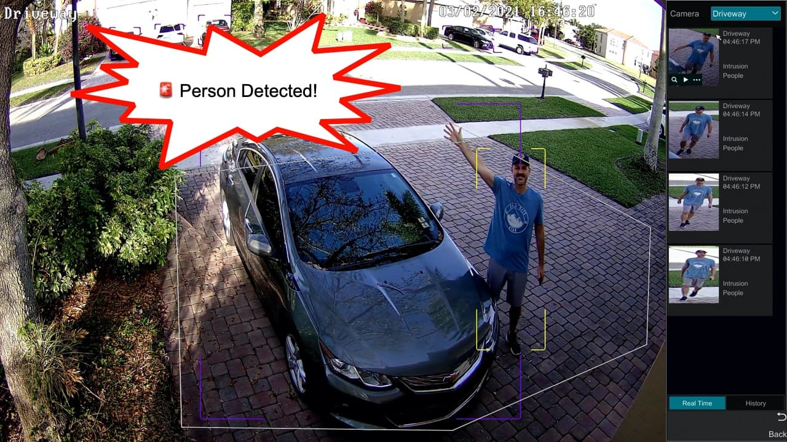

## A14 – 5 AI-Enabled Security Solutions

## Description
I explored different AI-enabled security solutions used in real-world environments to improve detection, monitoring, and protection against security threats.

## Findings
- AI-based antivirus systems that detect malware using behaviour analysis
- AI-powered email filters that detect spam and phishing messages
- Fraud detection systems used in financial services to identify suspicious activities
- AI surveillance systems that detect and track people or unusual behaviour
- AI-based threat detection systems that analyse patterns to identify potential risks

## Evidence
Figure 1: Examples of spam emails detected by Google AI-Powered Spam Filter

Figure 2: AI surveillance system detecting a person in real time.

## Analysis
AI-enabled security solutions improve the ability to detect threats more efficiently and accurately. For example, email systems use AI to filter phishing and spam messages by analysing patterns and content. AI surveillance systems can detect and track individuals automatically, improving monitoring and response time. Compared to traditional systems, AI can identify unusual behaviour and new types of threats, making security systems more effective.

## Reflection
This activity helped me understand how AI is widely used in modern security systems to enhance detection and improve overall protection.