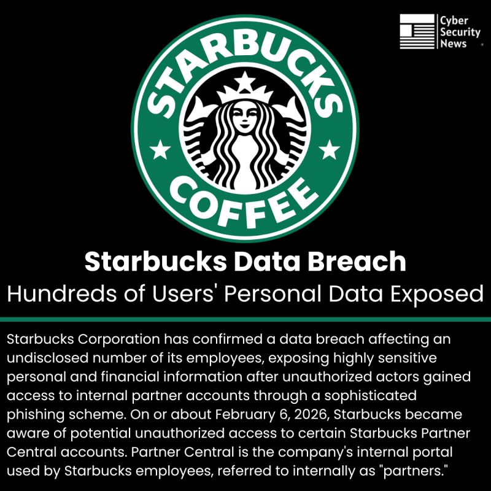
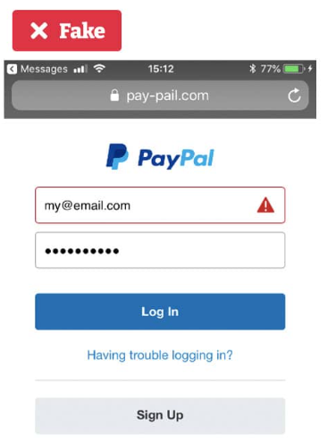

## A15 – Security incidents

## Description
I researched recent cybersecurity incidents to understand common threats and their impact on organisations and individuals.

## Findings
- Data breaches exposing personal and financial information
- Phishing attacks using fake websites to steal user credentials
- Ransomware attacks encrypting data and demanding payment
- Social engineering attacks manipulating users into revealing information
- Malware infections spreading through unsafe downloads

## Evidence
Figure 1: Example of a data breach involving Starbucks, exposing sensitive user information.

Figure 2: Fake PayPal login page used in a phishing attack to steal user credentials.

## Analysis
Recent security incidents demonstrate the growing threat of cyberattacks targeting both organisations and individuals. Data breaches can expose large volumes of sensitive information, leading to financial loss and reputational damage. Phishing attacks are highly effective because they exploit human trust rather than technical vulnerabilities. Ransomware attacks disrupt operations by restricting access to critical systems, while malware infections compromise device security. These incidents highlight the importance of strong cybersecurity measures, user awareness, and regular system updates to reduce risks.

## Reflection
This activity helped me understand how different types of cyberattacks occur and their impact in real-world situations. It emphasised the importance of being cautious online and implementing security measures to protect sensitive data.