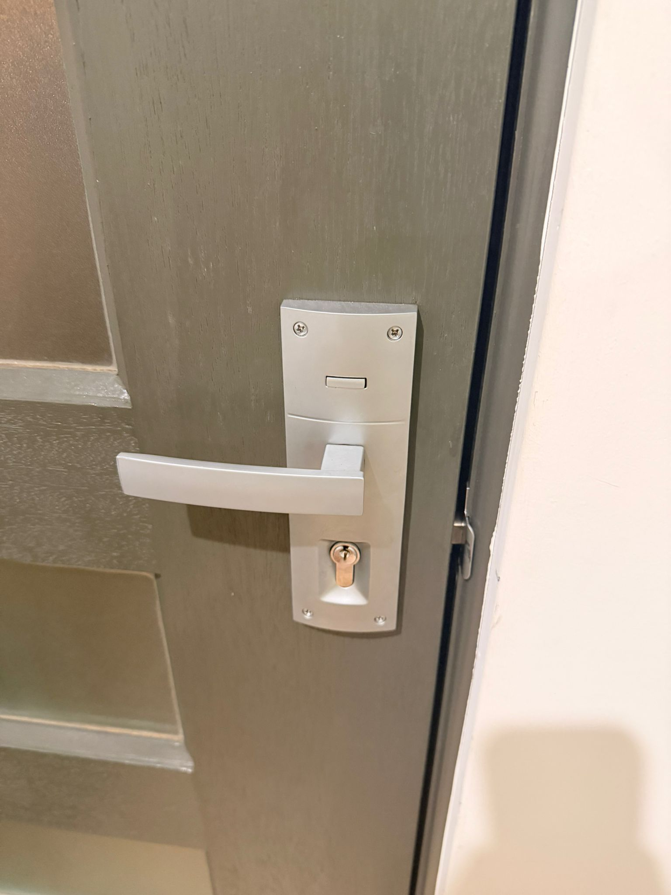
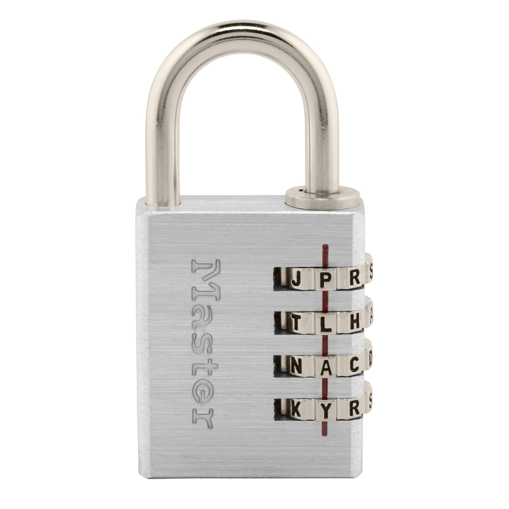
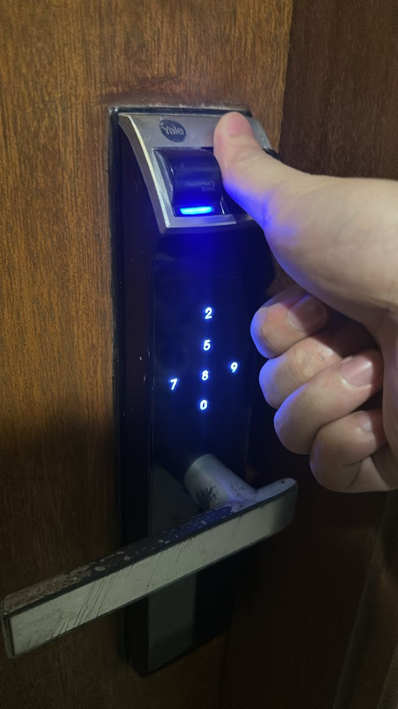

## A17_10_different_types_of_locks_in_use

## Description
I explored different types of locks used in everyday environments to secure property and prevent unauthorised access.

## Findings
1. Padlock
2. Deadbolt lock
3. Knob lock
4. Lever handle lock
5. Mortise lock
6. Chain lock
7. Combination lock
8. Smart lock
9. Keycard lock
10. Biometric lock

## Evidence
Figure 1: Padlock used to secure gates, lockers, or bicycles.

Figure 2: Deadbolt lock providing strong resistance against forced entry.

Figure 3: Combination lock that uses a code instead of a key.

Figure 4: Biometric lock using fingerprint recognition for access.

## Analysis
Locks are fundamental physical security mechanisms used to prevent unauthorised access. Traditional locks such as padlocks and deadbolts provide strong mechanical protection, while modern locks like biometric and smart locks offer enhanced security through authentication technologies. Combination locks eliminate the need for keys, reducing the risk of key loss or duplication. Each type of lock has different strengths and weaknesses, and choosing the appropriate lock depends on the level of security required.

## Reflection
This activity helped me understand the variety of locking mechanisms used in everyday life. It highlighted the importance of selecting appropriate locks based on security needs and the benefits of combining traditional and modern locking systems.