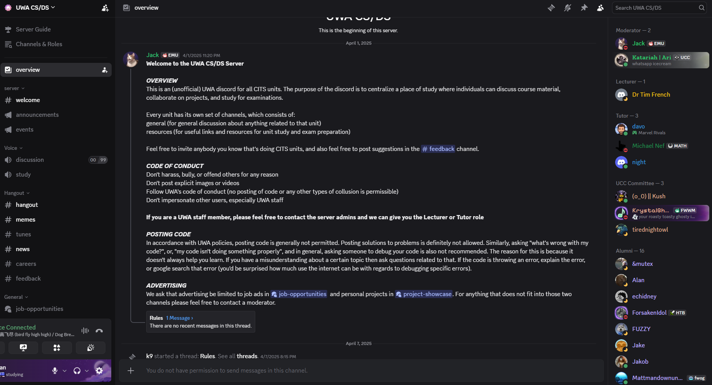

## A19 – Join a Cybersecurity

## Description
I joined an online cybersecurity and computer science community to engage with others and discuss technical topics.

## Findings
- The community allows discussion of cybersecurity and computing topics
- Members can collaborate on projects and share resources
- Channels are organised for different purposes such as study, discussion, and feedback

## Evidence
Figure 1: UWA CS/DS Discord server used for discussion and collaboration on technical topics.

## Analysis
Joining a cybersecurity or computing community provides opportunities to learn from others and stay updated on current topics. These platforms encourage knowledge sharing, collaboration, and problem-solving. Engaging in such communities helps improve understanding of cybersecurity concepts and practical skills.

## Reflection
This activity helped me understand the value of participating in cybersecurity communities to enhance learning and stay informed.