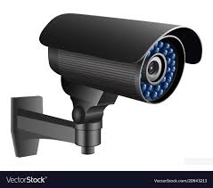

# A1 - Campus Security

## Description
I explored my university campus and identified security measures.

## Findings
- CCTV cameras installed at entrances
- Access control systems

## Evidence

## Analysis
These measures help prevent unauthorized access and improve surveillance. However, blind spots in camera coverage may still exist.

## Reflection
This activity helped me understand how layered security is applied in real-world environments.