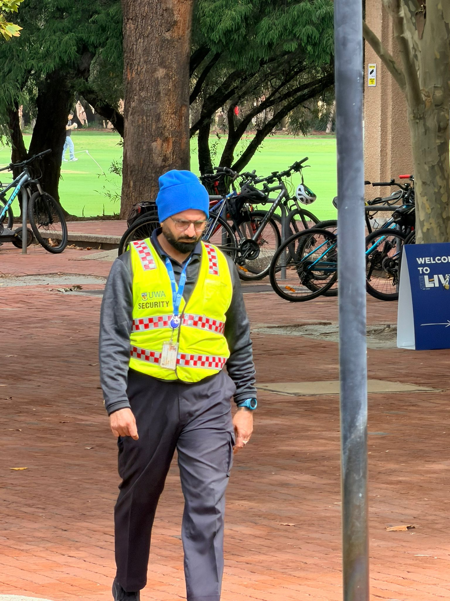
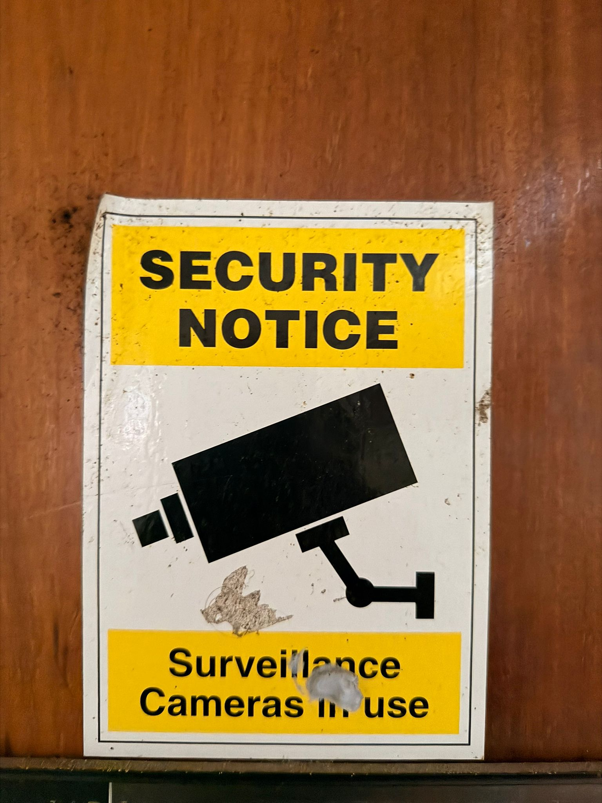
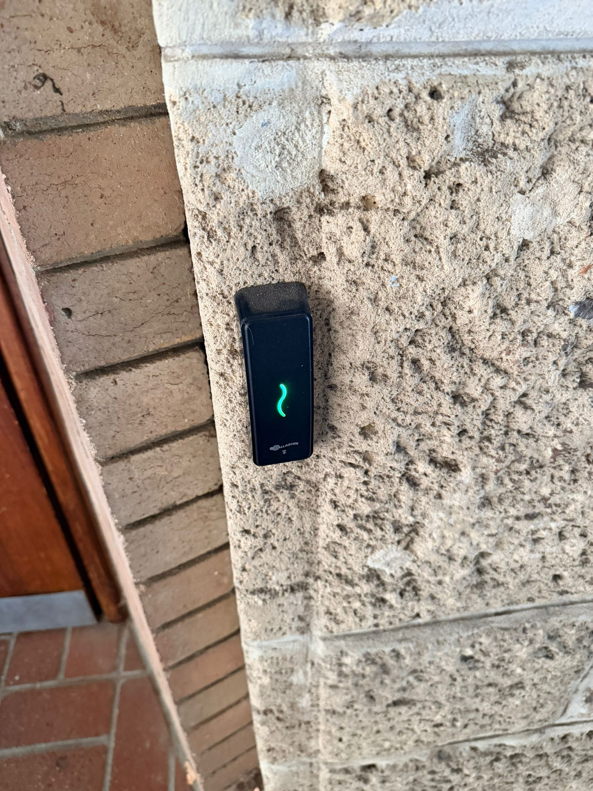
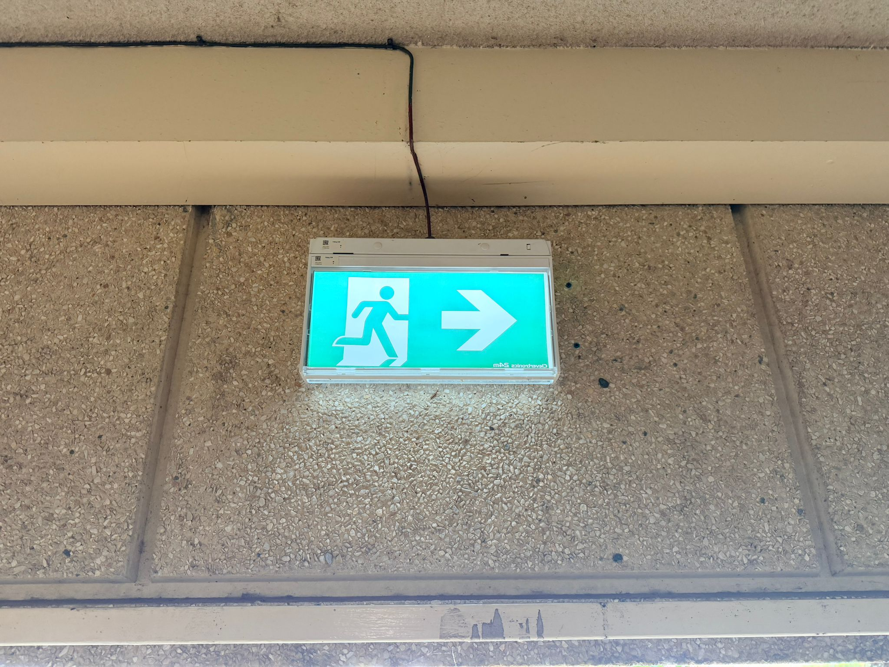

# A1 - Campus Security

## Description
I explored my university campus, including building entrances and common areas, to identify different security measures used to ensure safety.

## Findings
- Security personnel patrolling the campus
- CCTV surveillance systems installed at building entrances, walkways, and common areas
- CCTV warning signs indicating surveillance in operation
- RFID card access control systems at building entrances
- Fire safety systems such as alarms and emergency exit signs

## Evidence
Figure 1: Security personnel patrolling the campus to maintain safety and respond to incidents.

Figure 2: Security notice indicating surveillance cameras are in operation.

Figure 3: RFID card access system used to restrict entry to authorised individuals.

Figure 4: Fire alarm activation point used during emergencies.

Figure 5: Emergency exit sign guiding occupants to safe evacuation routes.

## Analysis
Together, these security measures form a layered security system. Security personnel provide real-time monitoring and rapid response to incidents. CCTV systems act as both a deterrent and a monitoring tool, helping to prevent and investigate security issues. Access control systems ensure that only authorised individuals can enter restricted areas, reducing the risk of unauthorised access. Fire alarms and emergency exit systems enhance safety by enabling quick evacuation during emergencies. However, limitations such as blind spots in camera coverage and reliance on human monitoring may reduce overall effectiveness.

## Reflection
This activity helped me understand how multiple layers of security are implemented in real-world environments. It highlighted the importance of combining physical security, surveillance, and access control systems to improve overall campus safety.