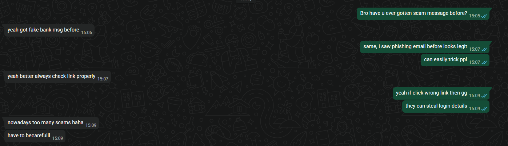

## A20 – Discussion with Friends about Cybersecurity

## Description
I participated in a discussion with a friend about cybersecurity topics, focusing on scams and phishing attacks.

## Findings
- Scam messages pretending to be from banks
- Phishing emails that look legitimate
- Risks of clicking suspicious links
- Importance of checking links before interacting

## Evidence
Figure 1: Conversation discussing scam messages and phishing risks.

## Analysis
The discussion highlighted how common scams and phishing attacks are in everyday life. Attackers often create messages that appear legitimate to trick users into revealing sensitive information such as login credentials. Both participants recognised the importance of verifying links and being cautious when receiving unexpected messages. This shows that user awareness plays a critical role in preventing cybersecurity threats.

## Reflection
This activity helped me understand that discussing cybersecurity with others can improve awareness and reduce the risk of falling victim to scams.