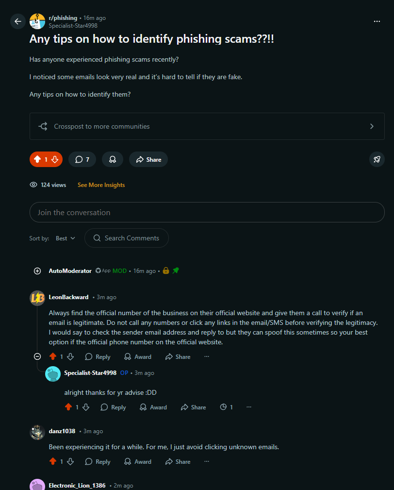

## A21 Participate in an online cybersecurity discussion

## Description
I participated in an online cybersecurity discussion by posting a question about phishing scams and engaging with responses from other users.

## Findings
- Phishing emails can look very realistic and are difficult to identify
- Users should verify information through official sources instead of clicking links
- Checking sender email addresses can help detect suspicious messages
- Avoiding unknown links is an effective way to prevent phishing attacks

## Evidence
Figure 1: Online discussion on phishing scams with multiple user responses and interaction.

## Analysis
The online discussion showed that phishing is a common cybersecurity threat experienced by many users. Participants shared practical strategies such as verifying sender details and avoiding suspicious links. The interaction highlights how online communities can help improve cybersecurity awareness by sharing real experiences and advice. This demonstrates the importance of user knowledge and collective discussion in reducing cybersecurity risks.

## Reflection
This activity helped me understand how online discussions can be a useful way to learn about cybersecurity threats and solutions from others’ experiences.