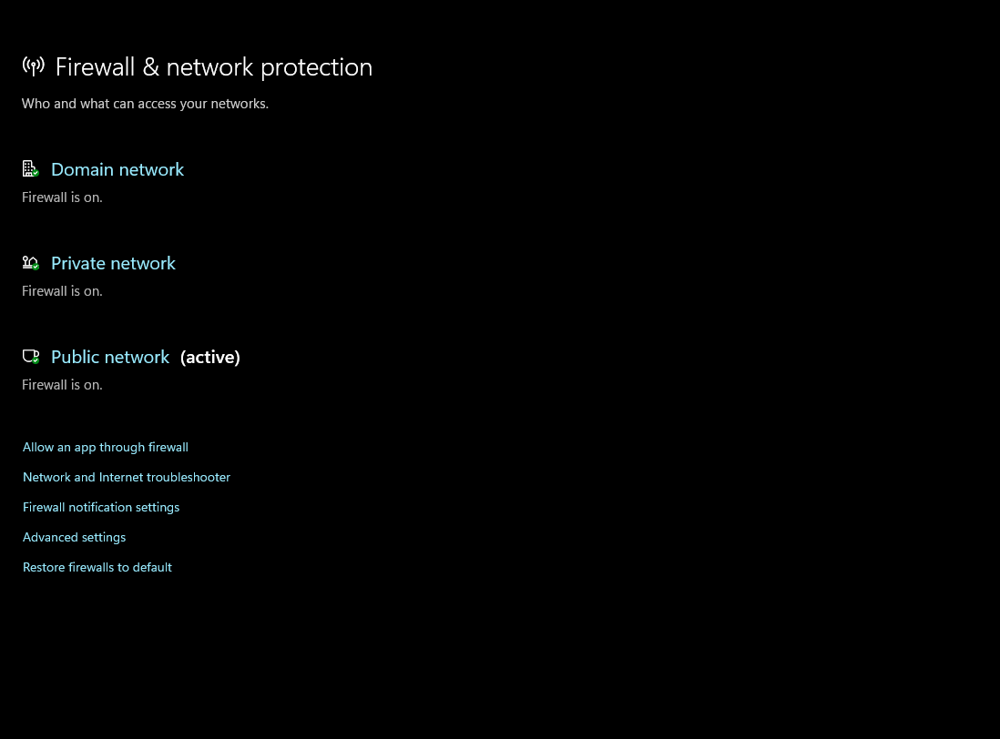

## A23 Enhance the cybersecurity at your home

## Description
I enhanced cybersecurity at my home by enabling key security features on my personal device to protect data and prevent unauthorised access.

## Findings
- Enabled device encryption to protect sensitive data
- Activated firewall and network protection to defend against external threats

## Evidence
Figure 1: Device encryption enabled to protect data from unauthorised access.

Figure 2: Firewall and network protection enabled to secure the system.

## Analysis
These measures improve cybersecurity by protecting both stored data and network access. Device encryption ensures that data remains secure even if the device is lost or stolen. The firewall helps monitor and control incoming and outgoing network traffic, reducing the risk of unauthorised access or cyber attacks. Together, these improvements strengthen the overall security of the home environment.

## Reflection
This activity helped me understand the importance of enabling built-in security features to protect personal devices and data from potential cyber threats.