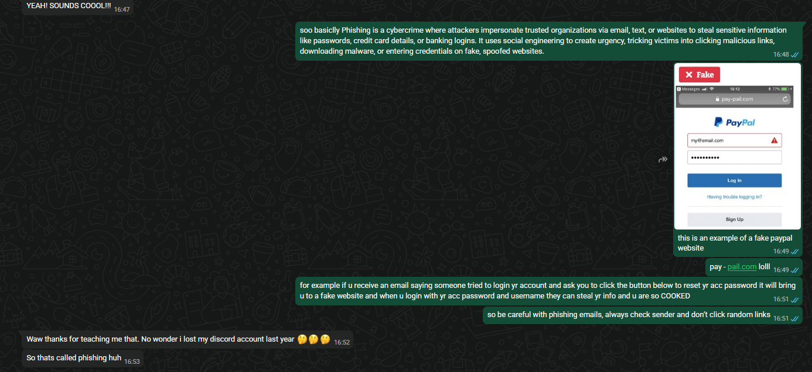

## A24 – Educating Others about Cybersecurity

## Description
I educated a brother about cybersecurity by explaining phishing attacks and how to identify and avoid them.

## Findings
- What phishing is and how attackers impersonate trusted organisations
- How fake websites can be used to steal login credentials
- The risks of clicking suspicious links in emails or messages
- The importance of checking sender details before taking action

## Evidence
Figure 1: Conversation where I explained phishing attacks and how to avoid them.

## Analysis
Educating others about cybersecurity helps reduce the risk of falling victim to attacks. In this discussion, phishing was explained using real examples, making it easier to understand how attackers trick users. The interaction also showed that many people are unaware of these threats until they experience them. Sharing knowledge improves awareness and encourages safer online behaviour.

## Reflection
This activity helped me understand the importance of spreading cybersecurity awareness to others to prevent common attacks such as phishing.