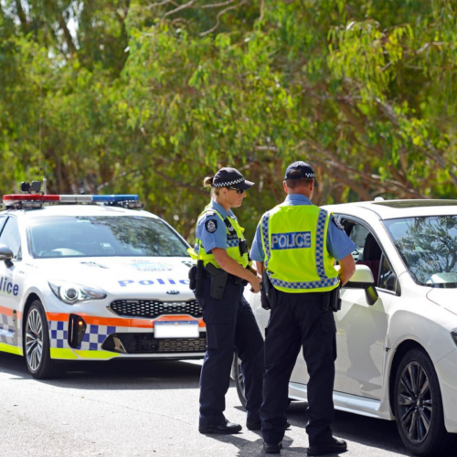
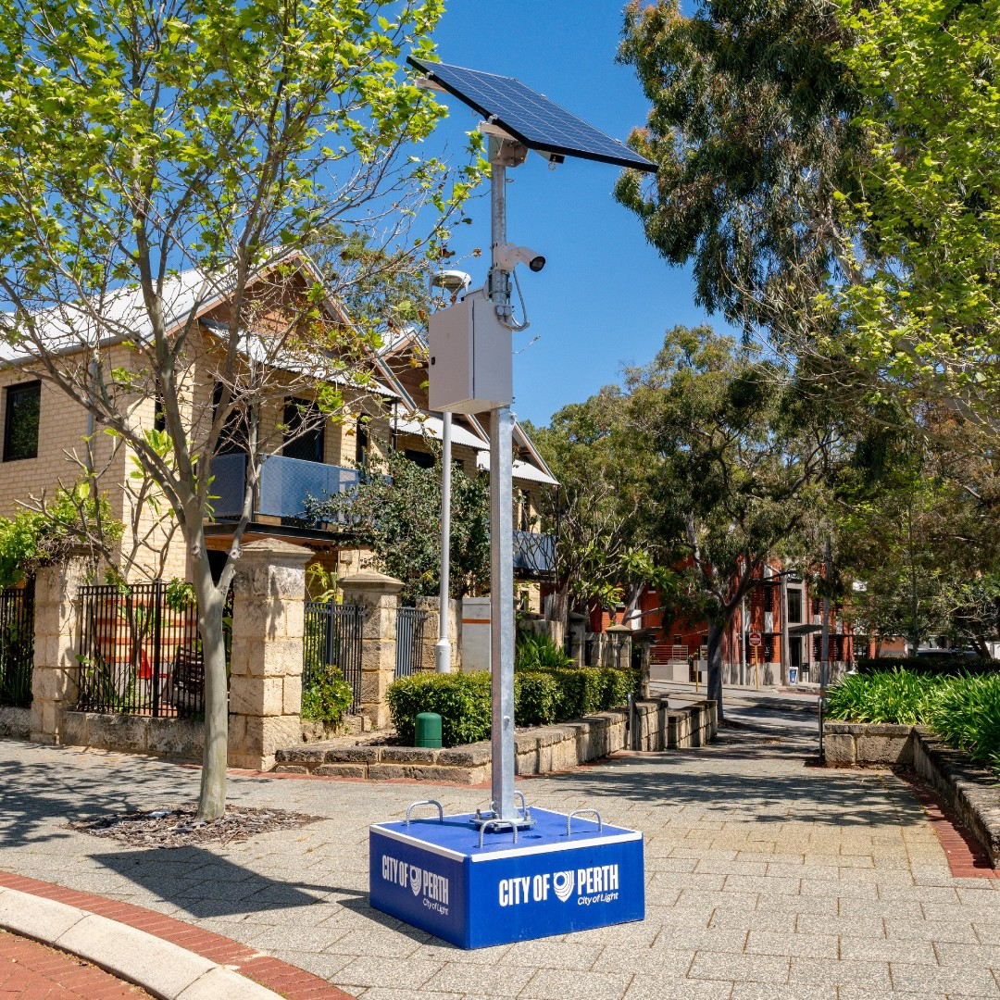
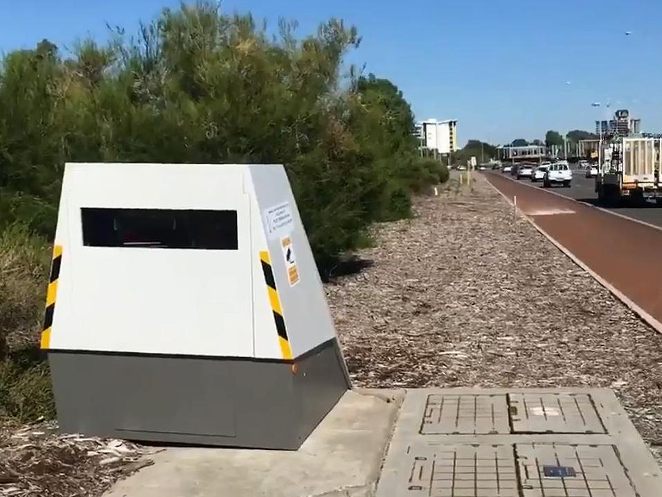
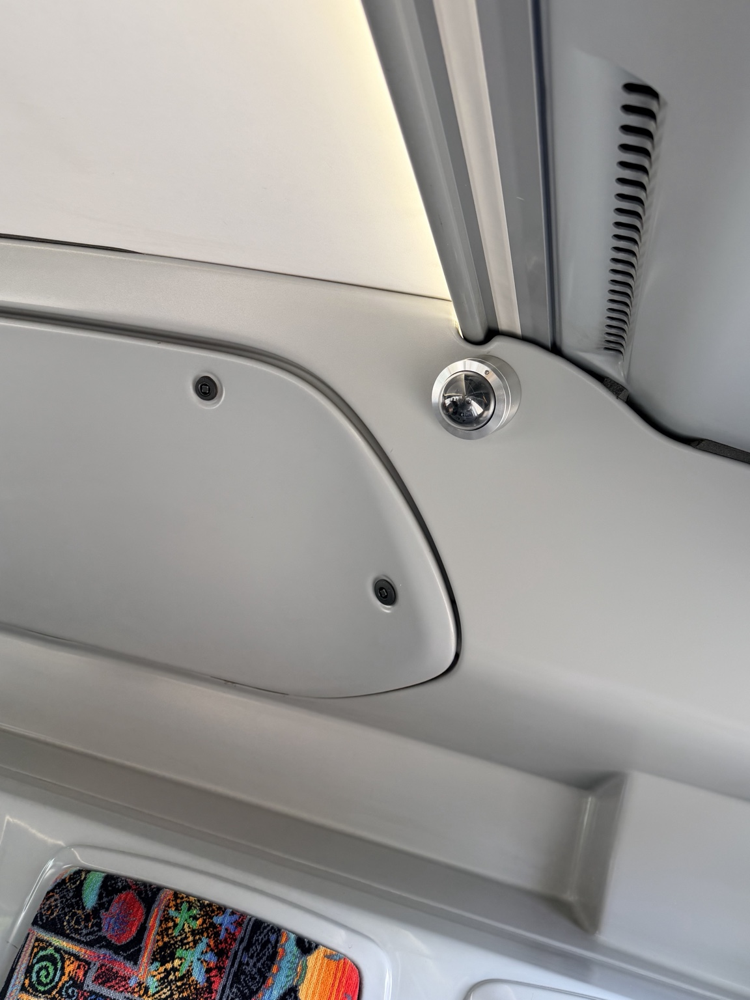

# A2_Public_Security

## Description

I explored public areas around my university campus to identify security measures used to ensure the safety of the general public and prevent potential threats.

## Findings

- Security personnel patrolling public areas and transport systems
- Speed enforcement cameras used to regulate traffic and improve road safety
- Emergency help points available for public assistance
- CCTV cameras installed inside public transport vehicles for passenger monitoring

## Evidence

Figure 1: Security personnel patrolling public transport areas to ensure safety and respond to incidents.  

Figure 2: CCTV camera installed in a public area for monitoring and surveillance.  

Figure 3: Speed enforcement camera used to monitor vehicle speed and improve road safety.  

Figure 4: Emergency help point allowing individuals to request assistance in emergencies.  

Figure 5: Dome CCTV camera installed inside a bus to monitor passenger activity and enhance safety.  

## Analysis
These public security measures work together to maintain safety and order in shared environments. Security personnel provide immediate response and enhance public confidence in safety. CCTV systems act as both a deterrent and a monitoring tool, helping to prevent criminal activity and support investigations. Speed cameras contribute to road safety by enforcing traffic regulations and reducing dangerous driving behaviour. Emergency help points provide a direct way for individuals to request assistance, improving response time during incidents. CCTV cameras inside public transport vehicles further enhance security by monitoring passenger behaviour and deterring incidents such as theft or vandalism. However, the effectiveness of these systems depends on proper monitoring, maintenance, and enforcement.

## Reflection
This activity helped me understand how various public security systems are integrated to protect people in everyday environments. It highlighted the importance of combining human presence, surveillance technology, and emergency response systems to enhance overall public safety.