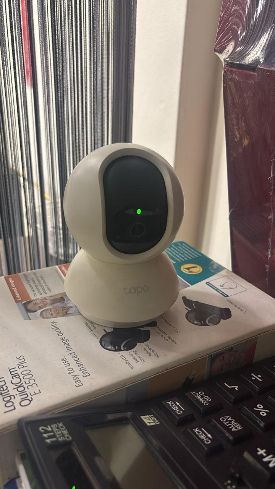
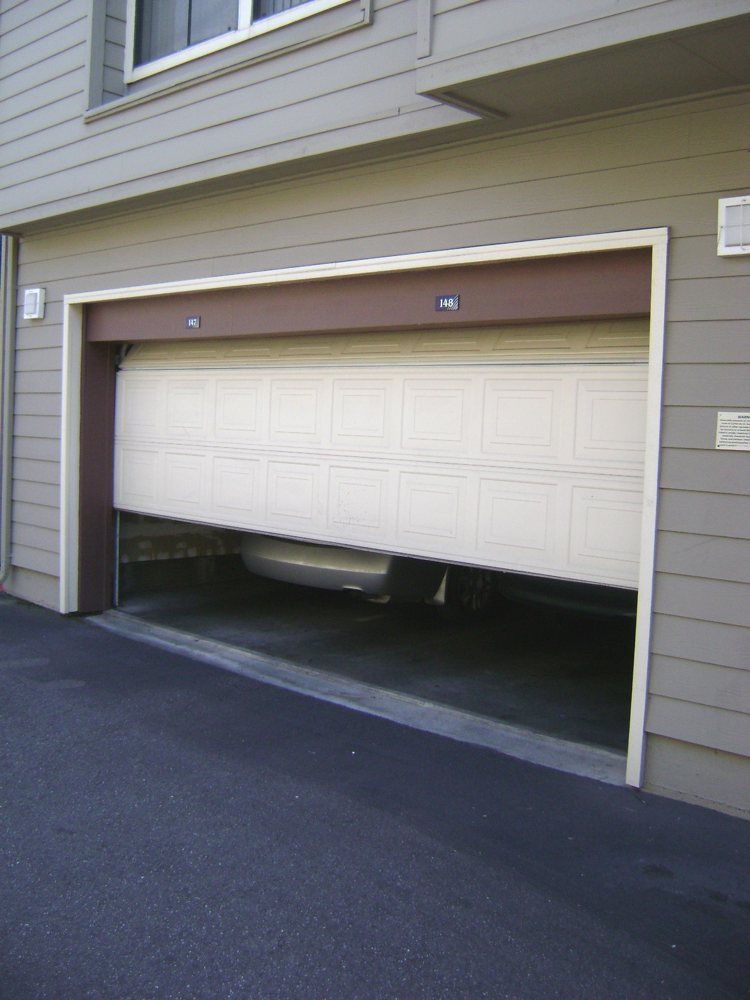

# A3_Home_Security

## Description

I explored security measures used in a home environment to protect property and ensure the safety of occupants.

## Findings

- Surveillance cameras installed to monitor activities around the house
- Biometric access control systems such as fingerprint door locks
- Garage doors acting as controlled entry points to restrict access
- Physical locks used to secure doors and prevent unauthorised entry

## Evidence

Figure 1: Surveillance camera installed to monitor activities and deter intruders.

Figure 2: Biometric fingerprint door lock used to allow access only to authorised individuals.

Figure 3: Garage door acting as a controlled access point to secure vehicles and property.

## Analysis
Home security systems provide multiple layers of protection against potential threats. Surveillance cameras act as both a deterrent and monitoring tool, allowing homeowners to observe activities in real time. Biometric systems such as fingerprint locks enhance security by ensuring only authorised users can access the property, reducing the risk of key duplication. Garage doors also serve as an important security barrier, preventing unauthorised entry into the home. Combining these systems creates a layered defence strategy, although their effectiveness depends on proper installation and regular maintenance.

## Reflection
This activity helped me understand how modern home security systems integrate physical and technological solutions to improve safety. It highlighted the importance of using multiple security layers to protect homes more effectively.