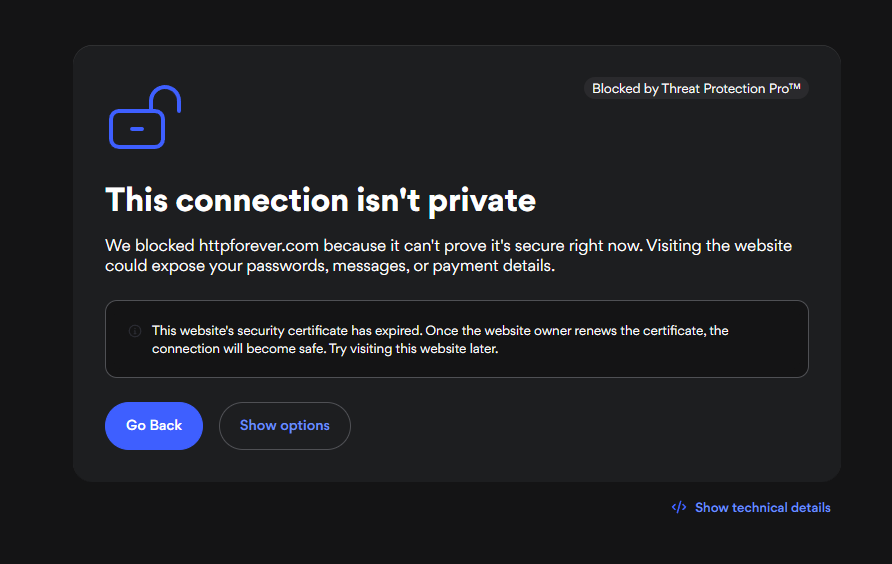

## A4_Vulnerable website

## Description
I explored a vulnerable website that does not provide a secure connection due to issues with its security certificate.

## Findings
- The website connection is not private
- The security certificate has expired
- The browser warns that sensitive information may be exposed

## Evidence
Figure 1: Browser warning showing an insecure connection due to an invalid or expired certificate.

## Analysis
A website with an invalid or expired certificate cannot establish a secure HTTPS connection. This means data transmitted between the user and the website may be exposed to attackers. Browsers display warnings to prevent users from accessing such insecure websites. This highlights the importance of valid certificates in maintaining secure communications and protecting user data.

## Reflection
This activity helped me understand how browsers detect insecure websites and warn users about potential security risks.