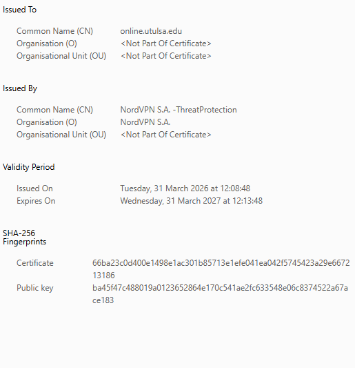

## A5 _Cryptography_Used_Online

## Description
I explored how cryptography is used in online environments to protect data, ensure privacy, and secure communications between users and websites.

## Findings
- HTTPS protocol used to encrypt communication between users and websites
- SSL/TLS encryption securing data transmitted over the internet
- Digital certificates used to verify website identity and authenticity
- Public key cryptography used to establish secure connections
- Password hashing used to protect stored user credentials

## Evidence
Figure 1: Secure HTTPS connection indicated by the lock icon, showing encrypted communication.

Figure 2: Digital certificate details showing issuer, validity period, and cryptographic fingerprint.

## Analysis
Cryptography is fundamental to online security as it ensures confidentiality, integrity, and authenticity of data. HTTPS, supported by SSL/TLS protocols, encrypts communication between users and servers, preventing interception by attackers. Digital certificates, issued by trusted authorities, verify the identity of websites and help prevent phishing attacks. Public key cryptography enables secure key exchange between parties, allowing encrypted communication without sharing secret keys in advance. Additionally, password hashing protects stored credentials by converting them into irreversible formats. These mechanisms work together to establish secure and trustworthy online systems.

## Reflection
This activity helped me understand how cryptographic techniques such as encryption and digital certificates are applied in real-world online systems. It highlighted the importance of trust, authentication, and secure communication in protecting users and their data.