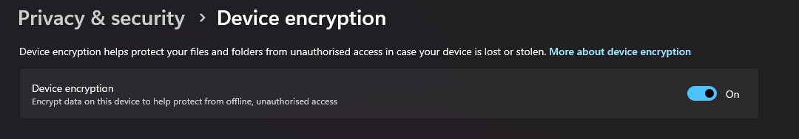

## A6 – Cryptography Offline

## Description
I explored how cryptography is used in offline environments to protect locally stored data and ensure that only authorised users can access a device.

## Findings
- Device encryption used to protect data stored on a computer
- Login authentication such as PIN or password used to restrict access
- Encryption ensures data remains unreadable without proper credentials
- Operating systems implement built-in encryption mechanisms
- Offline cryptographic protection is important when devices are lost or stolen

## Evidence
Figure 1: Device encryption enabled to protect data from unauthorised offline access.

Figure 2: Login authentication using a PIN to restrict access to the device.

## Analysis
Offline cryptography is essential for protecting data stored on devices without relying on internet connectivity. Device encryption ensures that all data on the system is converted into an unreadable format unless the correct credentials are provided. This prevents attackers from accessing sensitive information even if the device is stolen. Login authentication methods such as PINs or passwords act as the first layer of protection by restricting access to authorised users. Together, these mechanisms ensure confidentiality and protect against physical threats to data security.

## Reflection
This activity helped me understand how cryptographic techniques are used locally to secure data. It showed that even without internet access, encryption and authentication play a critical role in protecting sensitive information.