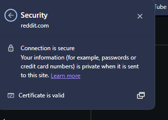
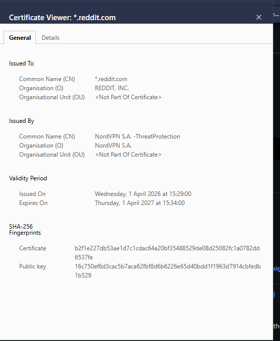

## A7. Discover cryptography used in modern networks

## Description
I explored how cryptography is used in network communications to secure data transmitted over the internet.

## Findings
- Websites use HTTPS to encrypt communication between users and servers
- SSL/TLS certificates are used to verify the identity of websites
- Encrypted connections protect sensitive information such as passwords and personal data

## Evidence
Figure 1: Secure HTTPS connection indicating encrypted communication.

Figure 2: SSL/TLS certificate showing verification of website identity.

## Analysis
Cryptography plays a key role in securing network communications. HTTPS uses encryption protocols such as TLS to protect data from being intercepted by attackers. The SSL/TLS certificate ensures that the website is legitimate and trusted. This prevents attacks such as man-in-the-middle attacks and protects user data during transmission.

## Reflection
This activity helped me understand how encryption is used in everyday internet usage to secure communication and protect sensitive information.