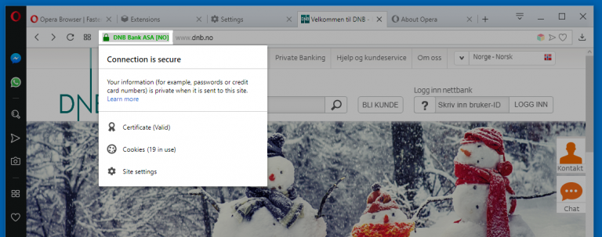

## A8 – cryptography used in Internet of Things devices

## Description
I explored how cryptography is used in IoT (Internet of Things) devices to secure communication between devices and online services.

## Findings
- Secure connections (HTTPS) are used to encrypt data transmitted between devices and servers
- Encryption ensures sensitive information remains private during transmission
- Certificates are used to verify that devices are communicating with trusted services

## Evidence
Figure 1: Secure HTTPS connection showing encrypted communication used by devices.

## Analysis
Cryptography is essential in IoT systems because devices frequently communicate over the internet. Encryption protects data from being intercepted or modified by attackers. Secure protocols such as HTTPS ensure that communication between IoT devices and servers is confidential. Certificates also help verify the authenticity of the server, preventing devices from connecting to malicious sources. These protections are critical for maintaining the security of IoT environments.

## Reflection
This activity helped me understand how cryptography is used in IoT systems to ensure secure communication and protect sensitive data.