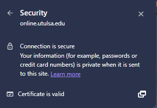
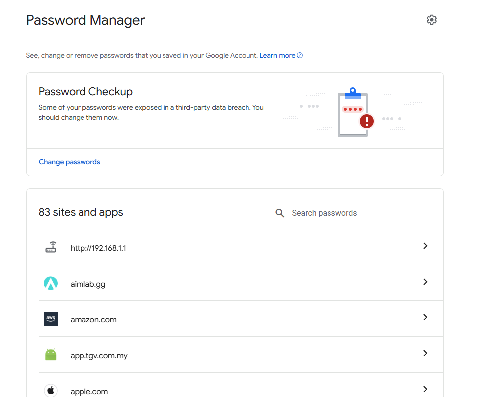

## A9_Privacy_Online

## Description
I explored how privacy is protected online.

## Findings
- HTTPS encryption protects data  
- Password managers secure passwords  
- Security tools protect devices  

## Evidence
Figure 1: Secure HTTPS connection ensuring data privacy during online communication.

Figure 2: Password manager storing credentials securely to protect user accounts.

## Analysis
These tools help protect personal data and prevent unauthorised access. Encryption ensures safe communication, while password managers improve account security.

## Reflection
This activity helped me understand how privacy is protected online.