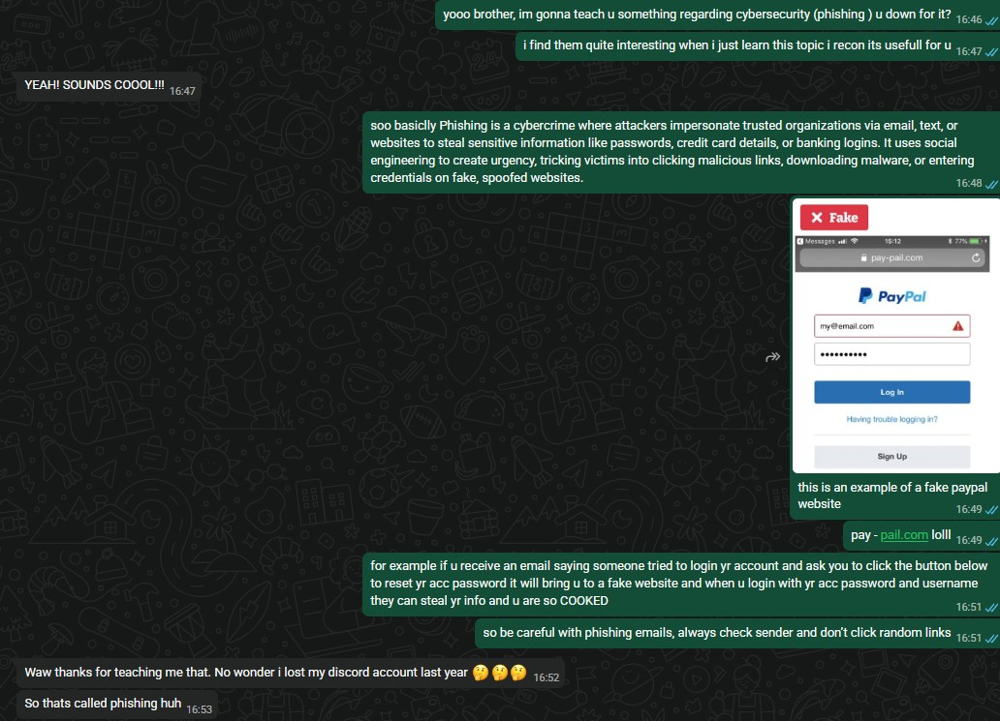

## B14_Teach Your Friends About Cybersecurity

## Description
I taught my friend about cybersecurity awareness, specifically focusing on phishing attacks and fake login websites.

## Findings
- What phishing attacks are
- How attackers create fake login websites
- How phishing emails trick victims into revealing passwords
- The importance of checking suspicious links and sender details

## Evidence
Figure 1: Conversation teaching a friend about phishing scams and fake login websites.

## Analysis
Phishing attacks are one of the most common forms of cybercrime and often rely on social engineering techniques to deceive victims. Attackers impersonate trusted organisations and create fake websites that appear legitimate in order to steal sensitive information such as usernames and passwords. In this discussion, I explained how users can identify suspicious links and avoid interacting with fake login pages. Teaching cybersecurity awareness is important because human error remains one of the biggest security vulnerabilities in modern systems.

## Reflection
This activity helped me improve my ability to explain cybersecurity concepts in a simple and understandable way. I realised that many people may not fully understand phishing risks until they experience scams themselves, making awareness and education extremely important. 