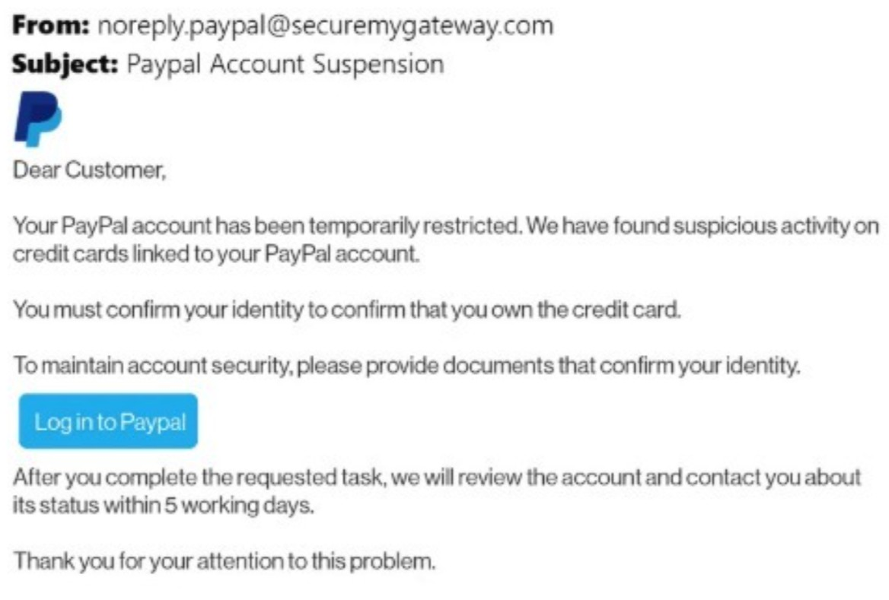
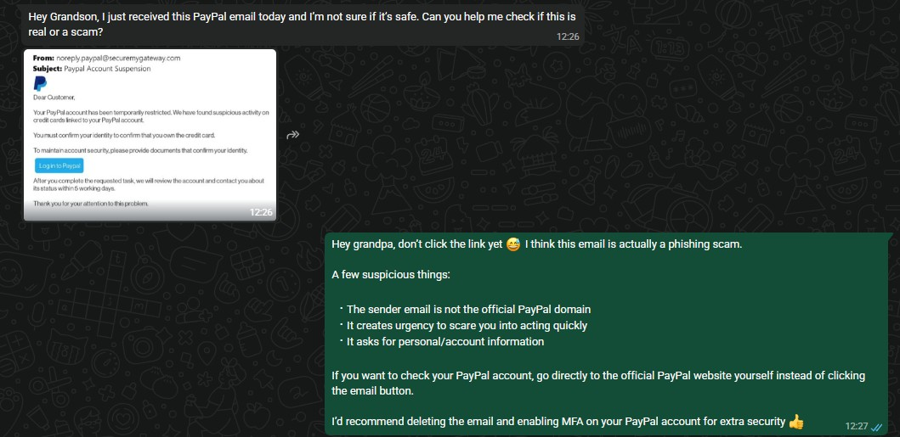
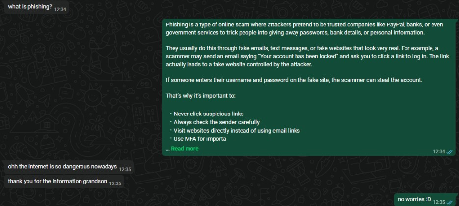

## B15_Teach an Elderly Person About a Cybersecurity Topic

## Description
I helped educate my grandparent about phishing scams and online safety after they received a suspicious PayPal email asking for account verification. The activity focused on identifying phishing indicators and explaining safe cybersecurity practices.

## Findings
- The sender email was not an official PayPal domain
- The email used urgent language to pressure the victim
- The message requested sensitive account information
- The login button could redirect users to a fake phishing website
- Phishing attacks commonly use impersonation and social engineering techniques

## Evidence
Figure 1: Suspicious PayPal phishing email received by my grandparent.

Figure 2: My explanation identifying phishing indicators and warning not to click the link.

Figure 3: Explanation provided about what phishing means and how scammers operate.

## Analysis
Phishing is a form of social engineering attack where attackers impersonate trusted organisations to steal sensitive information such as passwords, banking details, or personal data. In this example, the attacker attempted to create urgency by claiming the PayPal account had suspicious activity and required immediate verification. The fake sender address and request for sensitive information were major warning signs. If the victim clicked the link and entered credentials into a fake website, attackers could potentially gain unauthorised access to the account. This activity demonstrates how phishing relies heavily on human manipulation rather than technical hacking alone. Educating users to recognise suspicious emails, avoid clicking unknown links, and verify websites carefully is an important part of cybersecurity defence.

## Reflection
This activity helped me better understand how phishing attacks target everyday users through fear, urgency, and impersonation. Explaining the scam to a non-technical person also improved my communication skills and ability to simplify cybersecurity concepts. I realised that cybersecurity awareness is very important because many attacks succeed due to human mistakes rather than technical weaknesses. Teaching others about phishing can help reduce the risk of scams and online fraud.