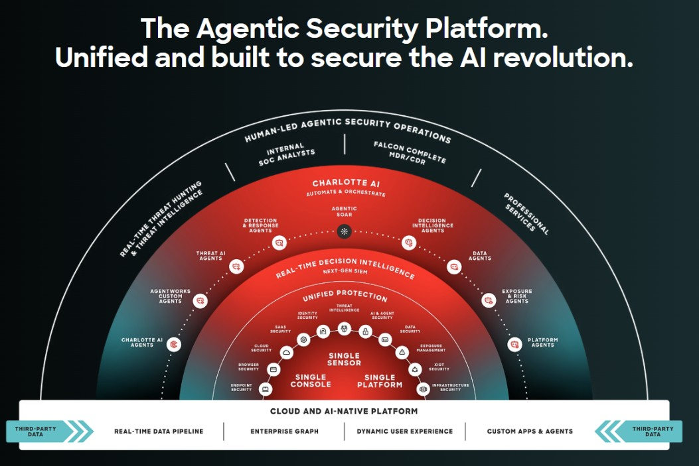
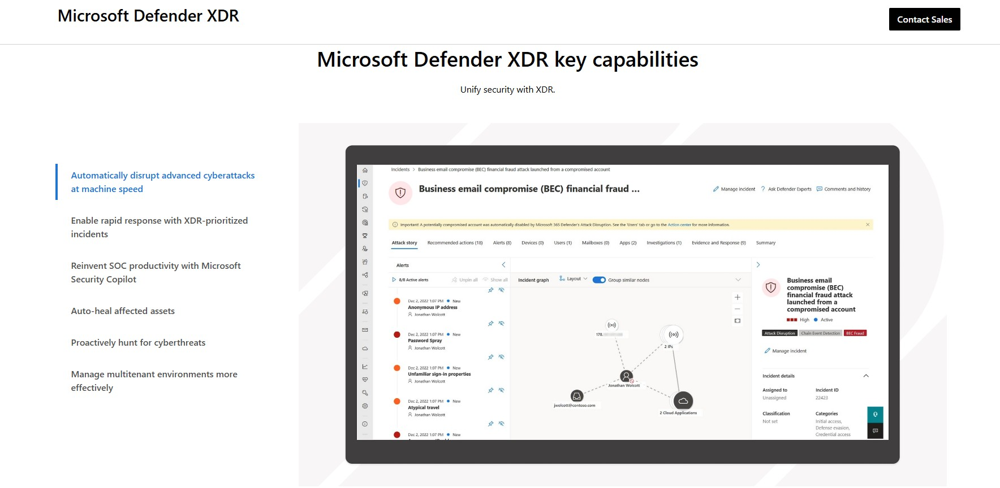
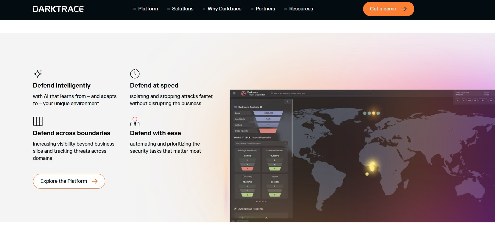

## B16_Survey the Current State-of-the-Art Solutions in Cybersecurity

## Description
For this activity, I researched several modern state-of-the-art cybersecurity solutions currently used by organisations worldwide. These platforms use advanced technologies such as Artificial Intelligence (AI), machine learning, behavioural analytics, endpoint detection and response (EDR), and extended detection and response (XDR) to detect and prevent cyberattacks in real time.

The solutions researched were:

1. CrowdStrike Falcon
2. Microsoft Defender XDR
3. Darktrace

## Findings
1. CrowdStrike Falcon

CrowdStrike Falcon is an AI-powered cybersecurity platform focused on endpoint protection, threat intelligence, and real-time incident response. It uses cloud-native architecture and AI agents to automate threat detection and response across organisations.

Key features discovered:

AI-powered threat hunting
Real-time detection and response
Unified protection platform
Cloud-native architecture
Automated security operations
2. Microsoft Defender XDR

Microsoft Defender XDR is an enterprise security platform that combines endpoint, identity, email, and cloud security into one unified system.

Key features discovered:

Automatic cyberattack disruption
Threat hunting capabilities
Security Copilot AI integration
Auto-healing systems
Incident prioritisation and response
3. Darktrace

Darktrace uses self-learning AI technology to detect abnormal behaviour inside networks and systems. The AI adapts to the organisation’s normal behaviour and identifies suspicious activities.

Key features discovered:

Behavioural analysis
Autonomous threat response
AI-powered anomaly detection
Real-time attack detection
Cross-platform visibility

## Evidence
Figure 1: Weak password example showing low password strength.

Figure 2: Website using HTTP without secure encryption.

Figure 3: Public WiFi network without password protection.

## Analysis
From the research, I observed that modern cybersecurity solutions heavily rely on AI and machine learning to improve detection speed and reduce human workload. Most platforms now integrate:

- Behavioural analytics
- Threat intelligence
- Automated response systems
- Cloud-based monitoring
- Endpoint protection

I also noticed that many companies are moving toward unified security platforms where multiple security tools are combined into a single dashboard for easier management.

Another common trend is the use of autonomous or AI-assisted response systems that can automatically isolate compromised devices, block malicious activity, and investigate incidents in real time.

## Reflection
This activity helped me understand how modern organisations defend themselves against increasingly advanced cyber threats. I learned that cybersecurity today is no longer only based on traditional antivirus software, but instead uses AI, behavioural monitoring, cloud analytics, and automation.

I also learned how important endpoint detection and response (EDR/XDR) systems are in detecting sophisticated attacks quickly. Researching these platforms improved my understanding of real-world cybersecurity technologies currently used in industry.