## B6_Attend 2 Cyber Ethics/Law Related Talks/Seminars

## Seminar 1: Ignorantia Juris Non Excusat – Understanding the Impact
## of the Law on the Hacker Community (Qatar Edition)

## Description
I attended a SANS DFIR webcast examining how cybercrime laws apply to the hacker community and cybersecurity researchers. The seminar explored how ethical hackers and security practitioners can unknowingly run afoul of criminal and civil law, using Qatar's Cybercrime Prevention Law (Law No. 14 of 2014) as a case study. The talk covered various types of laws and legal actions that could impact cybersecurity professionals, and how to work within applicable legal frameworks to avoid legal harm.

**Presenter:** Jason Jordaan (MSc, MTech, BComHons, BSc, BTech — SANS DFIR)
**Platform:** SANS DFIR Webcast
**Date Attended:** 17/05/2026

## Key Topics Covered
- Qatar Law No. 14 of 2014 — Cybercrime Prevention Law and its legal basis
- Article 2: Unauthorised access to state systems — up to 3 years imprisonment and QR500,000 fine, doubled if data is acquired or damaged
- Article 3: Cybercrimes punishable up to 1 year including spying, blackmail via unauthorised access, website defacement, privacy invasion, and defamation via IT devices
- Article 5: Serious cybercrimes punishable up to 4 years and 3,000,000 riyals including data destruction, network disruption, and service breakdown
- Social engineering: persuading someone to share credentials may not itself be a crime, but using those credentials to access a system without authorisation is a criminal offence
- Intent matters — unlawful access must be purposeful, not accidental
- Curiosity is not a legal defence for unauthorised access
- Latin principle: Ignorantia Juris Non Excusat — ignorance of the law is no excuse

## Evidence
Figure 1: Qatar Law No. 14 of 2014 — Cybercrime Prevention Law title page showing the legal basis referencing the Constitution, Penal Code, and Telecommunications Law.
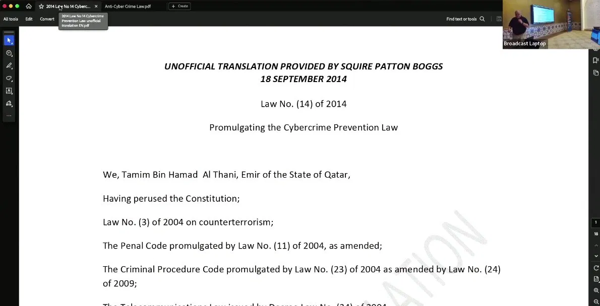
Figure 2: Article 2 — penalties for unauthorised access to state systems, up to 3 years and QR500,000, doubled for aggravated offences.
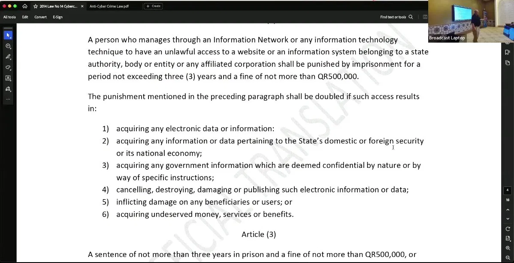
Figure 3: Article 3 — cybercrimes punishable up to 1 year including spying, blackmail, website defacement, and privacy invasion.
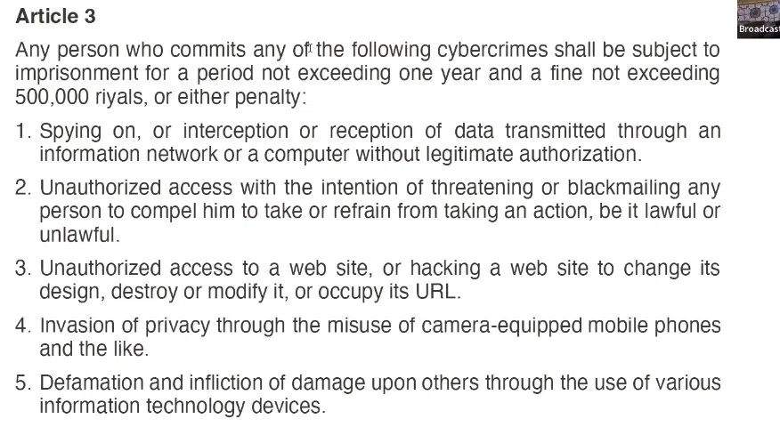
Figure 4: Article 5 — serious cybercrimes punishable up to 4 years including data destruction and network disruption.
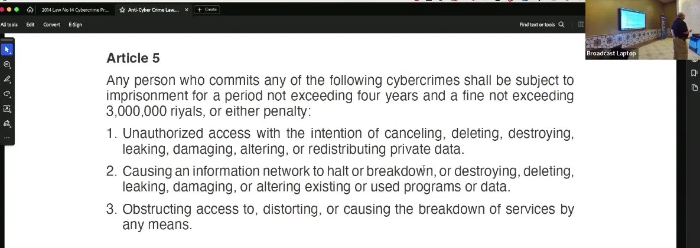
Figure 5: Presenter contact slide — Jason Jordaan, SANS DFIR.

## Analysis
This seminar highlighted a critical and often overlooked issue in cybersecurity: ethical hackers and security researchers can face serious criminal and civil legal consequences even when acting in good faith. Qatar's Cybercrime Prevention Law demonstrates how broadly cybercrime legislation can be interpreted. A key insight was the distinction between engineering (obtaining credentials through persuasion) and the actual criminal act of using those credentials to access a system without authorisation — the latter is clearly illegal regardless of intent. The escalating penalty structure across Articles 2, 3, and 5 shows how the severity of legal consequences increases with the nature and impact of the offence. The principle of Ignorantia Juris Non Excusat reinforces that cybersecurity professionals cannot claim ignorance of the law as a defence, making legal awareness an essential competency in the field.

## Reflection
This seminar significantly changed how I think about the legal risks faced by cybersecurity professionals. I had previously assumed that acting with good intent or out of curiosity provided some level of protection, but this talk made it clear that unauthorised access is illegal regardless of motivation. The discussion on social engineering was particularly thought-provoking — the legal boundary between obtaining credentials through persuasion and using them is subtle but critical. This activity reinforced the importance of always obtaining explicit written authorisation before any form of security testing, and of understanding the cybercrime laws applicable in the jurisdiction you operate in. As a cybersecurity student, this is knowledge I will carry throughout my career.

## Seminar 2: Cyber Incident Management – Working with Legal 
## and Law Enforcement

### Description
I attended a SANS Cybersecurity Leadership webcast on how incident response teams should engage with legal resources and law enforcement before and during a cyber incident.

**Presenter:** Steve Armstrong-Godwin (29+ years in security, 
SANS Instructor 15+ years, LDR553 Author, Danske Bank)
**Platform:** SANS Institute – Cybersecurity Leadership Webcast
**Date Attended:** 17/05/2026

### Key Topics Covered
- Legal team structure during incidents: internal legal, external counsel, local and national law enforcement
- Smaller incidents also require legal support: HR cases, insider threats, fraud, business email compromise
- Role of internal legal staff: covert evidence acquisition approvals, regulator notifications, data breach notifications
- FBI Internet Crime Complaint Center (IC3): $27.6 billion in losses reported over 5 years
- Engaging law enforcement at the right level based on organisation size and national importance
- TLP:RED information and why law enforcement controls what they share
- Importance of pre-incident kickoff meetings with legal teams to build trust and develop working practices

### Evidence
Figure 1: Presenter slide — Steve Armstrong-Godwin credentials and background.
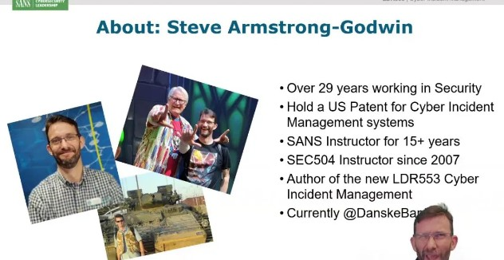
Figure 2: EA Games incident used as case study for incident command.
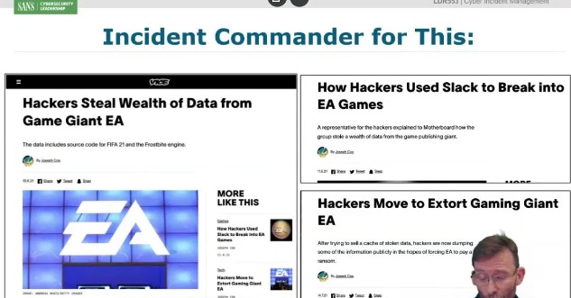
Figure 3: Core legal team structure slide.
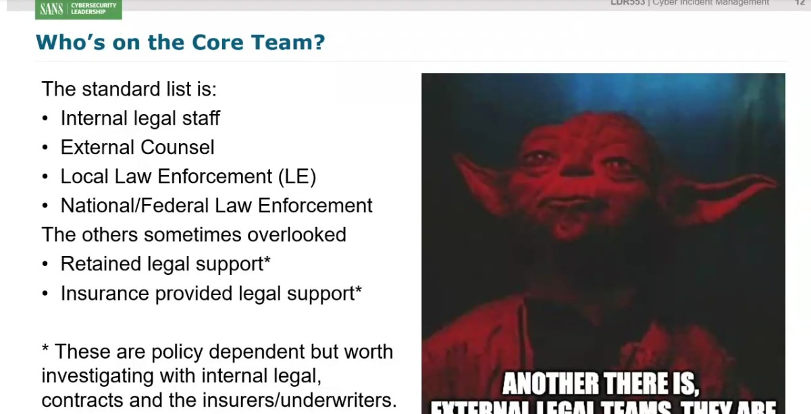
Figure 4: Local legal staff roles — evidence acquisition and regulator notifications.
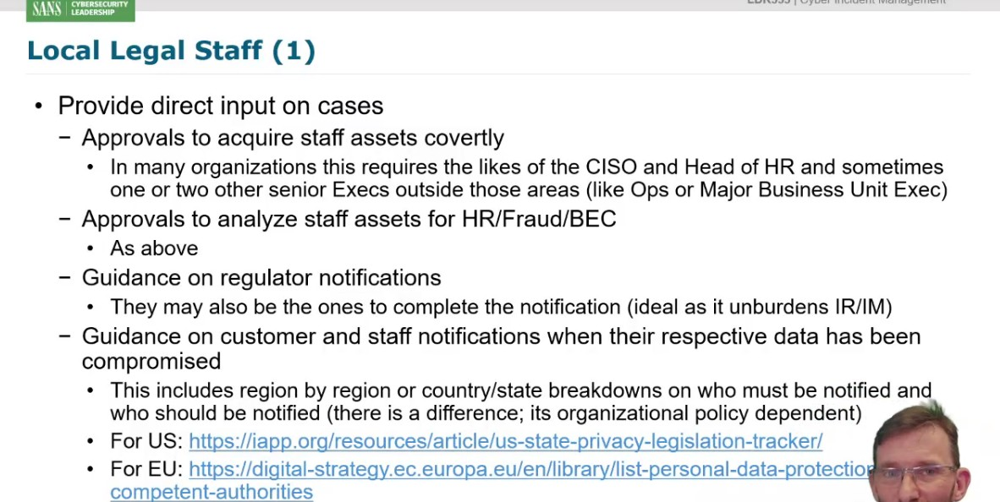
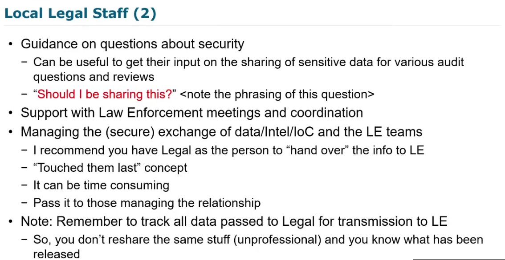
Figure 5: FBI IC3 complaints and losses over 5 years chart.
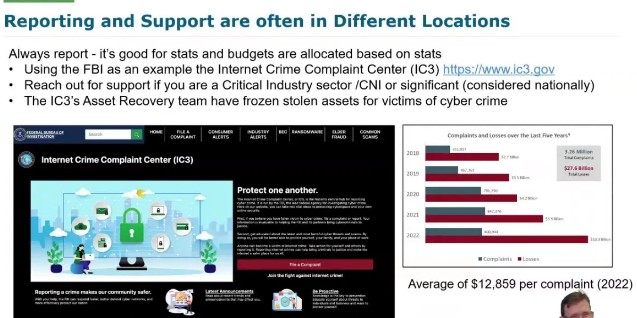
Figure 6: Working with law enforcement — TLP and trust framework.
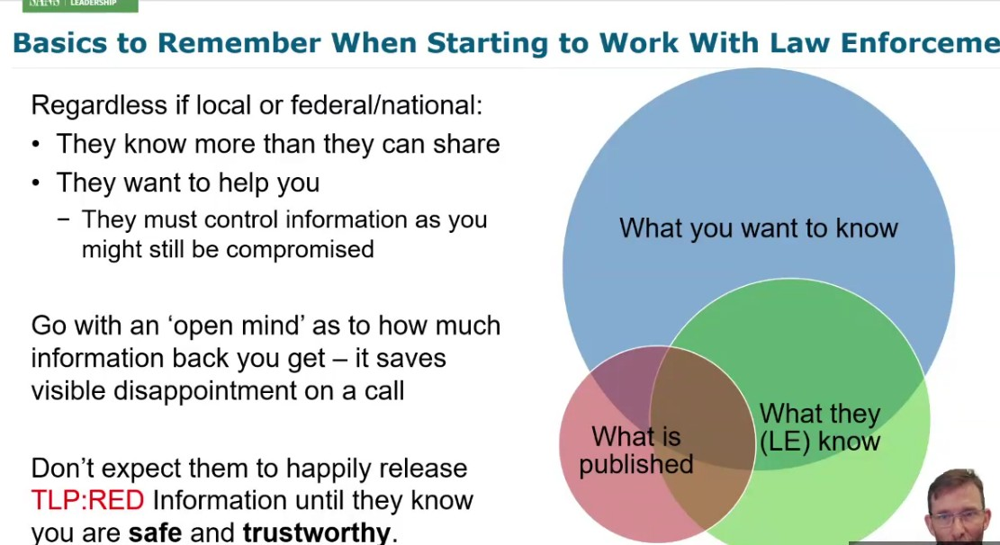
Figure 7: Summary slide — key action points.
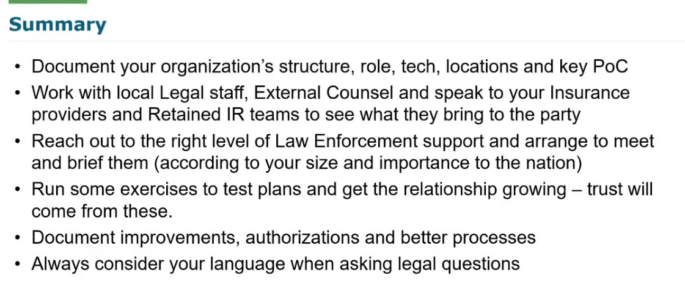

### Analysis
This seminar provided critical insight into the legal dimensions of cyber incident response. A key takeaway was that legal engagement must be established well before an incident occurs — waiting until a breach happens to figure out legal processes significantly slows response time and increases damage. The distinction between who must be notified vs who should be notified during a data breach was particularly important, as this varies by region and has significant legal implications. The IC3 statistics — $27.6 billion in losses — underscore the financial scale of cybercrime and why proper legal reporting channels matter. The concept of always asking "Should I be sharing this?" before disclosing information also reflects strong ethical practice in incident management.

### Reflection
This seminar made me appreciate that cybersecurity is not purely a technical discipline — legal knowledge and relationships are equally critical, especially during high-pressure incidents. I had not previously considered how much preparation goes into legal engagement before an incident, including kickoff meetings and trust-building with law enforcement. The framing advice — asking questions to get enabling answers rather than activity constraints — was a practical insight I will carry forward. This activity deepened my understanding of the intersection between cybersecurity operations and legal compliance.