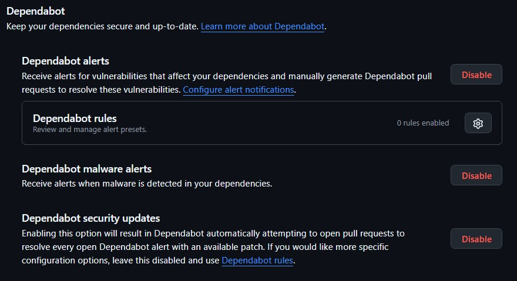
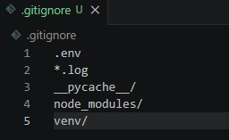
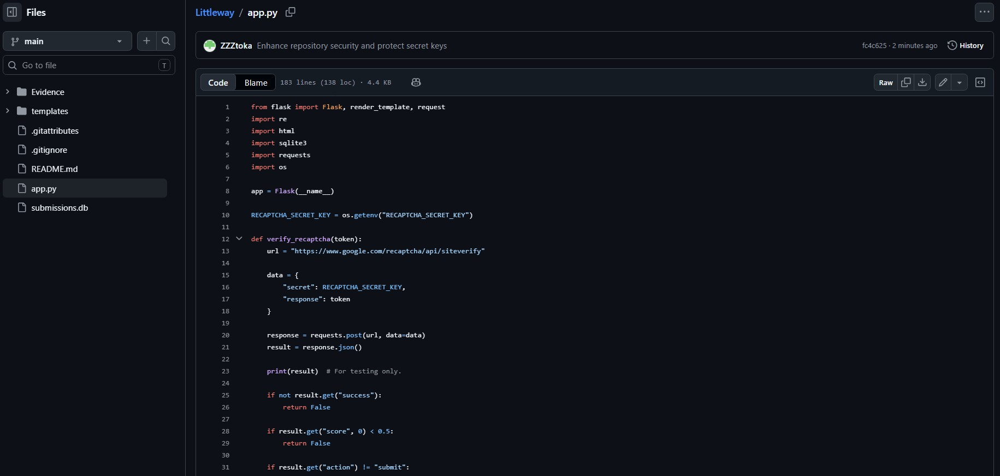

## B20_Enhance the Security of a GitHub Project

## Description
I enhanced the security of a GitHub project by improving repository security settings and protecting sensitive information from accidental exposure. The project focused on strengthening secure development practices through GitHub security features, secret management, and repository protection mechanisms.

# Project Repository

View the full source code and implementation here:

[Little Way Secure Contact Form Demo](https://github.com/ZZZtoka/littleway)

## Findings
- Enabled GitHub Dependabot alerts and security updates
- Enabled malware alert monitoring for project dependencies
- Added a .gitignore file to prevent sensitive files from being uploaded
- Stored the Google reCAPTCHA secret key securely using environment variables
- Prevented the .env file from being uploaded to GitHub
- Improved repository security hygiene and reduced the risk of credential exposure

## Evidence
Figure 1: GitHub Dependabot alerts and security update features enabled.

Figure 2: .gitignore configuration excluding sensitive files such as .env.

Figure 3: Application loading the reCAPTCHA secret key securely using environment variables instead of hardcoded credentials.

Figure 4: GitHub repository file list showing that the `.env` file is not uploaded, while `.gitignore` and project files are visible.

## Analysis
GitHub repositories may accidentally expose sensitive information such as API keys, credentials, or vulnerable dependencies if security measures are not properly configured. By enabling Dependabot alerts and automated security updates, the repository gained improved monitoring against known vulnerable packages and malicious dependencies. The .gitignore configuration also reduced the risk of uploading confidential files such as .env files containing secret keys.

Instead of hardcoding the Google reCAPTCHA secret key directly inside the application source code, the project used environment variables through os.getenv() to securely load the secret value during runtime. This approach improves secure secret management practices and reduces the likelihood of sensitive credentials being publicly exposed through the repository.

These improvements demonstrate the importance of repository security, secure coding practices, and proactive protection of sensitive information during software development.

## Reflection
This activity improved my understanding of secure software development and GitHub repository security management. I learned that cybersecurity is not only about protecting deployed applications, but also about securing development environments, dependencies, and sensitive configuration files. Implementing GitHub security features and secure secret management practices helped me better understand the importance of preventing accidental credential exposure and maintaining secure development workflows.