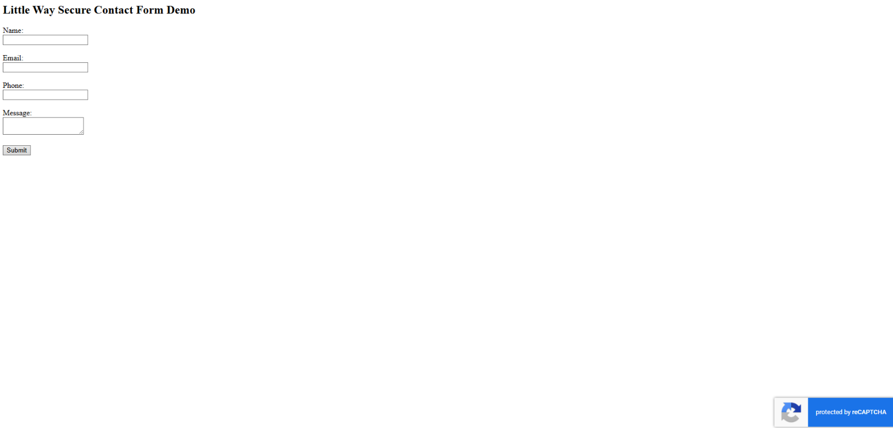
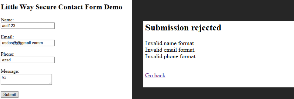
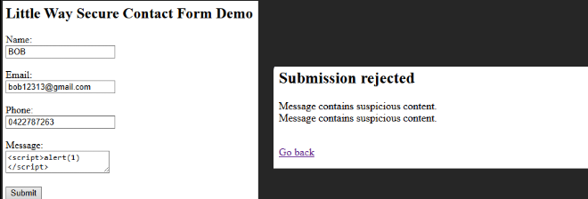
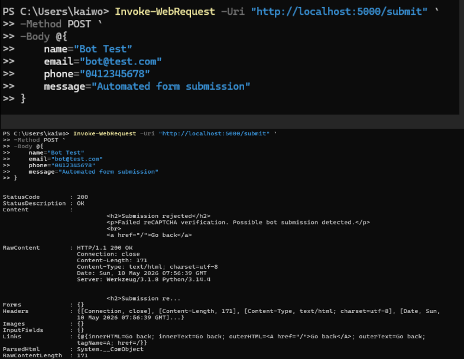
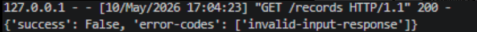

## B20_Enhance the Security of a GitHub Project

## Description
I enhanced the cybersecurity of a community/business website by designing and implementing a more secure contact form system for the Little Way website. The project focused on improving web form security against spam bots, malicious scripts, invalid user input, and automated attacks.

# Project Repository

View the full source code and implementation here:

[Little Way Secure Contact Form Demo](https://github.com/ZZZtoka/littleway)

## Findings
- Implemented Google reCAPTCHA v3 to reduce automated bot submissions
- Added server-side validation for name, email, phone number, and message fields
- Enforced format validation for user input
- Detected and blocked suspicious script injection attempts
- Tested automated form submission using PowerShell requests
- Verified rejection of suspicious and invalid requests through server-side responses

## Evidence
Figure 1: Secure contact form implementation with Google reCAPTCHA v3 enabled.

Figure 2: Invalid user inputs rejected by validation rules.

Figure 3: Suspicious script injection attempt detected and blocked.

Figure 4: Automated bot-style form submission tested using PowerShell.

Figure 5: Server-side response showing failed reCAPTCHA verification and rejection of suspicious requests.

## Analysis
Community and small business websites are common targets for spam, phishing abuse, malicious scripts, and automated bot attacks because they may lack strong defensive protections. By implementing Google reCAPTCHA v3, the website gained an additional behavioural analysis layer capable of detecting suspicious automated activity. Server-side validation and format checking also reduced the risk of malformed or malicious data being processed by the application.

The project successfully rejected invalid email addresses, suspicious script payloads, and automated PowerShell-based submissions that failed reCAPTCHA verification. Blocking suspicious content such as  reduced the risk of cross-site scripting attacks. These defensive measures demonstrate how layered security protections can improve the security posture of community websites and reduce common web application attack surfaces.

## Reflection
This activity improved my understanding of secure web application development and defensive cybersecurity practices. I learned that protecting community websites requires multiple layers of security including validation, bot detection, suspicious input filtering, and secure server-side processing. Implementing and testing these protections also helped me better understand how attackers attempt to abuse web forms and how developers can proactively defend against common web-based attacks.