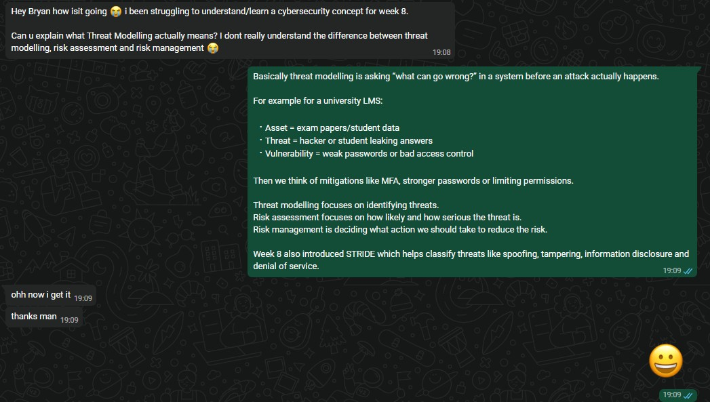

## B26_Help Another Student Understand a Cybersecurity Concept

## Description
I helped another student in the unit understand the cybersecurity concept of threat modelling from Week 8 materials.

## Findings
During the discussion, I explained the meaning of threat modelling and the differences between threat modelling, risk assessment, and risk management.

I used a university LMS example to simplify the explanation:

- Asset = exam papers and student data
- Threat = hackers or students leaking answers
- Vulnerability = weak passwords or poor access control

I also explained how STRIDE can be used to classify threats such as spoofing, tampering, information disclosure, and denial of service.

## Evidence
Figure 1: Conversation explaining threat modelling concepts to another student.

## Analysis
Threat modelling is an important cybersecurity process used to identify possible threats, vulnerabilities, and attack paths before security incidents occur. It helps organisations proactively design stronger security controls and reduce risks. Explaining technical concepts to other students improves cybersecurity awareness and reinforces understanding for both the learner and the person teaching the concept.

## Reflection
This activity improved my understanding of threat modelling and helped me practice communicating cybersecurity concepts in a simpler and more understandable way. Using real-world examples such as a university LMS system made the concept easier to explain and understand.