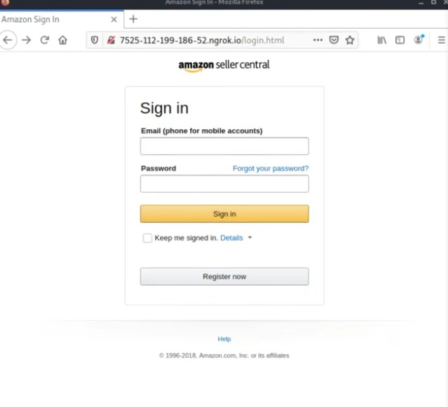

## B27_Apply a Learned Cybersecurity Concept to a Real-World Application (controlled test)

## Disclamer 
I did not:
- use real bank domains
- deploy publicly pretending to be real 
- collect passwords
- trick actual people

## Description
I applied cybersecurity concepts learned in this unit to a real-world phishing scenario by analysing a simulated fake login website and credential-harvesting demonstration.

## Findings
- A fake login page can visually imitate a trusted service such as Amazon Seller Central
- The suspicious URL was not an official Amazon domain
- Users may be tricked into entering login details if they do not check the website address
- Dummy credentials entered into the simulated page were captured by the tool
- Phishing attacks rely heavily on social engineering and user trust

## Evidence
Figure 1: Simulated Amazon Seller Central phishing page using a suspicious URL.

Figure 2: Dummy credentials captured during the controlled phishing awareness demonstration.

## Analysis
This activity applied the cybersecurity concepts of phishing, social engineering, credential theft, and threat modelling to a real-world scenario. The fake login page looked similar to a real Amazon login page, but the URL showed that it was not an official Amazon domain. This demonstrates how attackers use visual deception to make users trust malicious websites. The controlled dummy credential capture showed how phishing sites can collect usernames and passwords when users enter information without verifying the source. In a real attack, stolen credentials could lead to account takeover, data theft, or financial loss. Mitigations include checking URLs carefully, using password managers, enabling multi-factor authentication, and avoiding links from suspicious emails or messages.

## Reflection
This activity helped me understand how phishing attacks work in practice and why user awareness is important. I realised that a website’s appearance alone is not enough to prove it is legitimate. Users must check the domain name, connection security, and source of the link before entering sensitive information. This practical demonstration improved my understanding of how classroom cybersecurity concepts apply to real-world credential theft attacks.