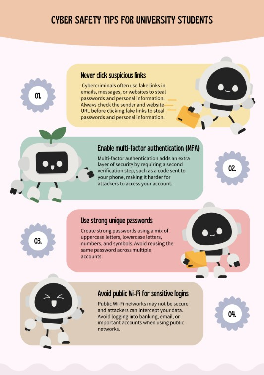

## B28_cyber safety flyer for university students

## Description
I designed and created a cyber safety flyer targeted at university students to promote awareness of common cybersecurity threats and safe online practices.

## Findings
- Identifying suspicious phishing links
- Enabling multi-factor authentication (MFA)
- Creating strong and unique passwords
- Avoiding unsafe public Wi-Fi networks for sensitive logins

## Evidence
Figure 1: Cyber safety flyer created for university students.

## Analysis
University students are frequent targets of phishing attacks, credential theft, and online scams because they regularly use online services such as email systems, cloud storage, and university portals. Educational awareness materials such as cyber safety flyers can help reduce human-related security risks by encouraging safer online behaviour. Preventive measures such as enabling MFA, checking suspicious links, and using strong passwords significantly improve account security and reduce the likelihood of cyberattacks.

## Reflection
This activity helped me improve my understanding of cybersecurity awareness and communication. I learned how to present cybersecurity advice in a simple and visually understandable way for a general audience while still delivering important security information effectively.