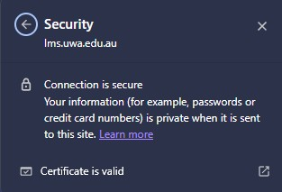
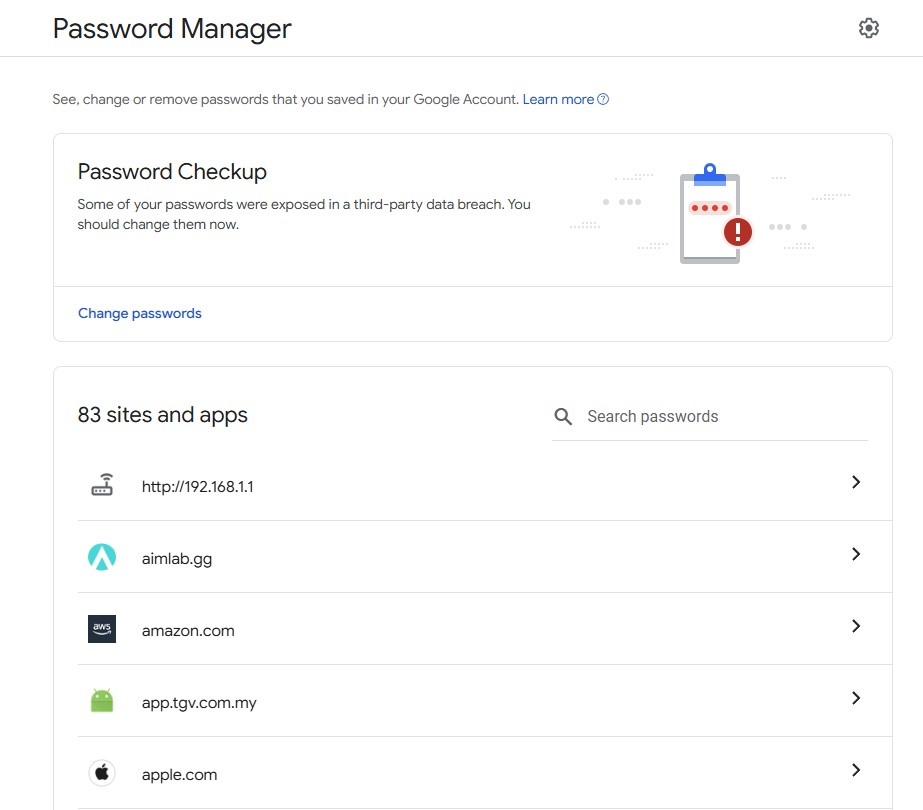
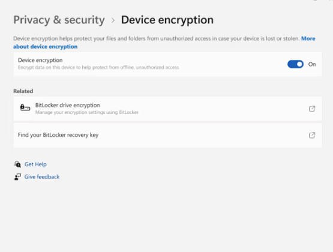
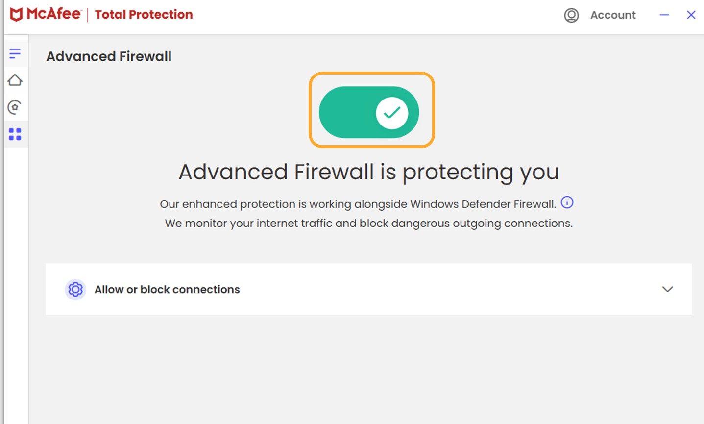

## B2_Discover 5 unique strong security implementations

## Description
I explored strong security implementations used in everyday systems to protect data and prevent cyber threats.

## Findings
- Secure websites using HTTPS encryption
- Multi-factor authentication for account protection
- Password managers for secure credential storage
- Device encryption to protect stored data
- Firewall systems controlling network access

## Evidence
Figure 1: Secure website showing HTTPS connection with encryption.

Figure 2: Two-factor authentication verification process.

Figure 3: Password manager storing credentials securely.

Figure 4: Device encryption enabled on system.

Figure 5: Firewall enabled to monitor and block threats.

## Analysis
Strong security implementations play a critical role in protecting systems from cyber threats. HTTPS ensures that data transmitted between users and websites is encrypted, preventing interception. Two-factor authentication adds an additional layer of security, reducing the risk of account compromise even if passwords are leaked. Password managers help generate and store complex passwords securely, mitigating the risk of weak credentials. Device encryption protects sensitive data at rest, ensuring that even if the device is stolen, the data remains inaccessible. Firewalls act as a barrier between trusted and untrusted networks, filtering malicious traffic and preventing unauthorised access.

## Reflection
This activity helped me understand the importance of implementing multiple layers of security rather than relying on a single defence mechanism. I realised that combining different security measures significantly improves protection against cyber threats.