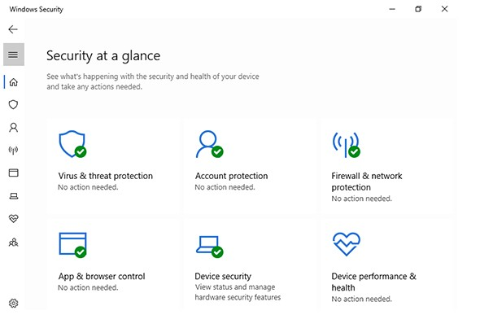

## B3_Proactive Security Implementations

## Description
I explored proactive security implementations that actively protect systems by preventing, detecting, and responding to cyber threats.

## Findings
- Antivirus software providing real-time threat detection
- Automatic system updates patching vulnerabilities
- Firewalls actively monitoring and blocking suspicious network activity

## Evidence
Figure 1: Antivirus software with real-time protection enabled.

Figure 2: System showing automatic updates enabled and up to date.

Figure 3: Firewall actively monitoring and controlling network traffic.

## Analysis
Proactive security implementations are essential in defending against modern cyber threats. Antivirus software continuously scans for malicious activity and can detect and remove threats in real time, reducing the risk of malware infections. Automatic updates ensure that known vulnerabilities are patched promptly, preventing attackers from exploiting outdated software. Firewalls actively monitor incoming and outgoing network traffic, blocking suspicious or unauthorised connections. These proactive measures reduce the attack surface and provide continuous protection, rather than relying on reactive responses after an attack occurs.

## Reflection
This activity helped me understand the importance of proactive security measures in preventing cyberattacks. I realised that regularly updating systems and enabling real-time protection significantly reduces the risk of being compromised.