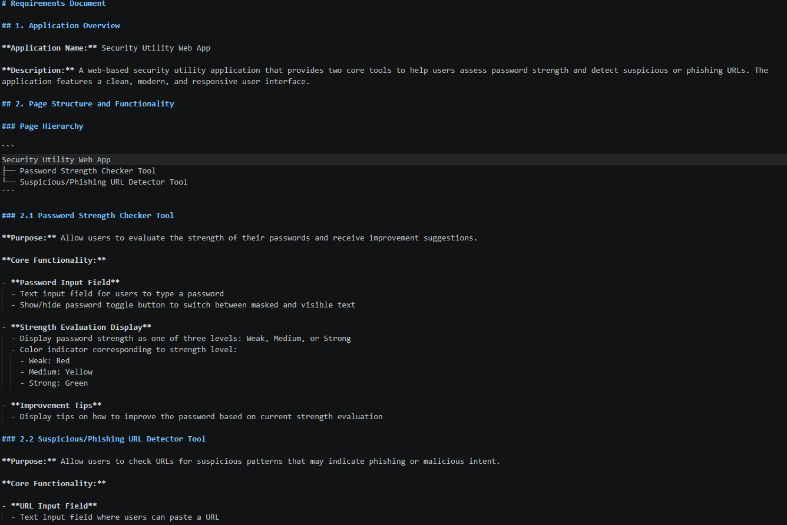
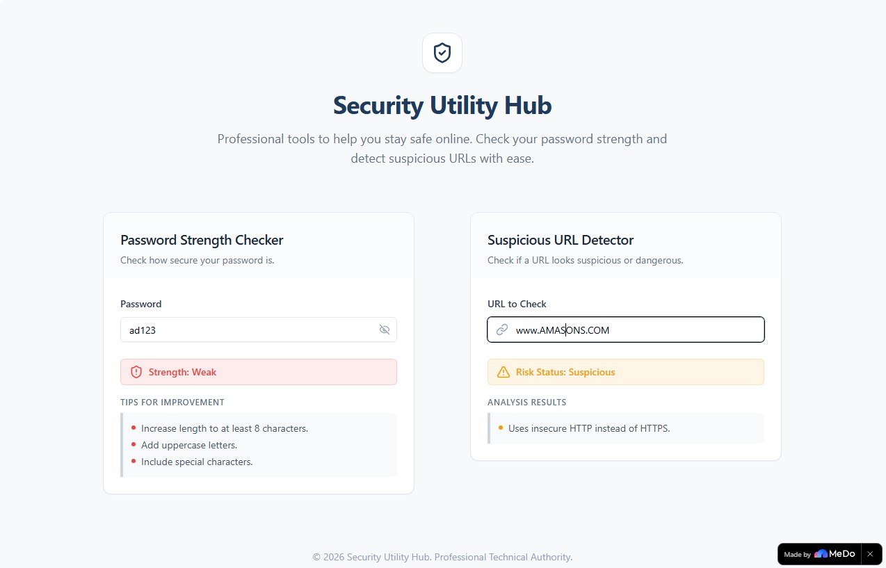
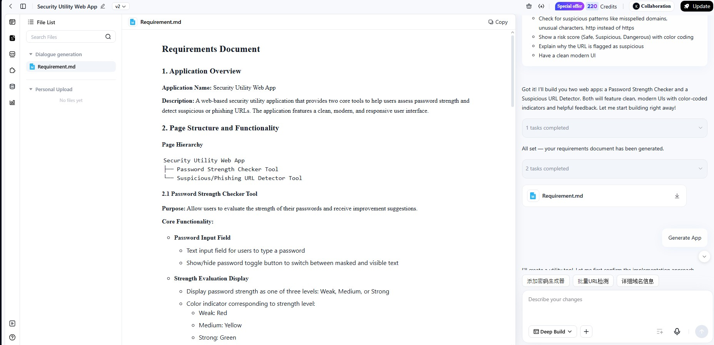
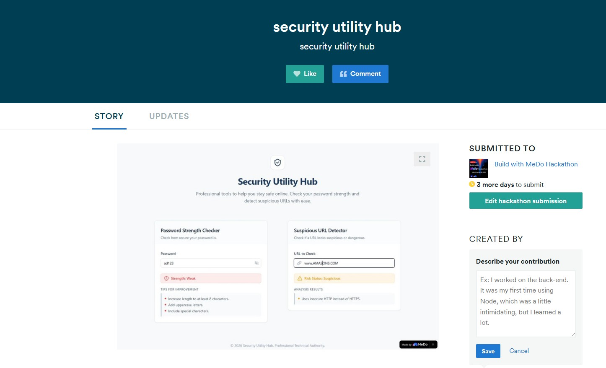

## B8_Participate in a Hackathon

## Description
I participated in the "Build with MeDo" Hackathon hosted on Devpost, where participants build fully functional applications using MeDo, an AI-powered app builder that turns natural language descriptions into deployable web applications. I built a cybersecurity-focused web application called "Security Utility Hub" using MeDo's AI platform.

**Hackathon:** Build with MeDo Hackathon
**Platform:** Devpost (medo.devpost.com)
**Category:** Work & Productivity / Surprise Us
**Duration:** April 9 – June 4, 2026

## What I Built
I developed a Security Utility Hub — a web-based application featuring two core cybersecurity tools:

**1. Password Strength Checker**
- Text input with show/hide password toggle
- Strength evaluation displayed as Weak, Medium, or Strong
- Color-coded indicators (Red, Yellow, Green)
- Improvement tips based on missing security criteria such as uppercase letters, special characters, and minimum length

**2. Suspicious/Phishing URL Detector**
- URL input field for users to paste any link
- Risk assessment displayed as Safe, Suspicious, or Dangerous
- Color-coded risk indicators (Green, Yellow, Red)
- Detailed explanation of detected suspicious patterns such as HTTP instead of HTTPS, misspelled domains, unusual characters, suspicious TLDs, and IP address usage

## How I Built It
I used MeDo's AI platform by describing the application requirements in natural language. I structured my conversations with MeDo to define the page hierarchy, core functionality, business logic for password evaluation and URL risk detection, exception handling, and acceptance criteria. MeDo generated the full-stack application based on these descriptions, which I then iterated on using the visual editor. The final application was deployed with one click to a public URL.

## Evidence
Requirements document generated defining the full application specification including page structure, business rules, and acceptance criteria. Please check requirement.md file

Figure 2: Deployed Security Utility Hub showing Password Strength Checker (left) flagging "ad123" as Weak with improvement tips, 
and Suspicious URL Detector (right) flagging "www.AMASONS.COM" as Suspicious due to HTTP usage.

Figure 3: MeDo AI platform showing the requirements document being processed and the app being generated, with 2 tasks completed including the Requirement.md file generation and app build initiation.

Figure 4: Devpost submission confirmation showing "Security Utility Hub" successfully submitted to the Build with MeDo Hackathon with 3 days remaining for edits.

## Analysis
Building this application for the hackathon demonstrated how AI-powered development tools can accelerate the creation of cybersecurity utilities. The Password Strength Checker addresses one of the most common security vulnerabilities — weak passwords — by providing real-time feedback and actionable improvement tips. The Suspicious URL Detector tackles phishing, which remains one of the most prevalent attack vectors, by identifying patterns commonly used in malicious URLs such as misspelled brand names (e.g. AMASONS vs AMAZON), insecure HTTP connections, and suspicious domain structures. Both tools together form a practical security awareness utility that can help everyday users make better security decisions.

## Reflection
Participating in this hackathon was a valuable experience that combined cybersecurity knowledge with practical application development. Using MeDo to build the app taught me how to effectively communicate technical requirements in natural language to an AI system — a skill increasingly relevant in modern software development. I gained a deeperunderstanding of password security criteria and URL-based phishing indicators through designing the business logic for both tools. The hackathon format also pushed me to think about real-world cybersecurity problems and how technology can help address them in an accessible way for non-technical users.